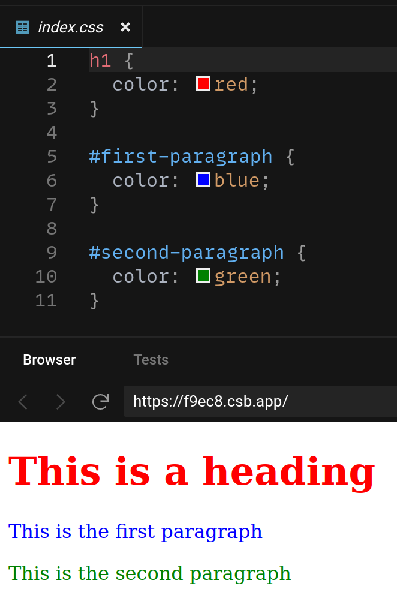

# Basic CSS

Cascading Style Sheets, or CSS, is a language for decorating content made with HTML. CSS is written in files called stylesheets that have a `.css` extension. CSS files are linked from HTML files, and the CSS files contain selectors and declarations that describe how the HTML page should look.

## CSS Selectors

To style an HTML element, you need to write code in CSS that selects it. You can either select all elements with the same tag, or you can select an element by its ID by putting a `#` in front of the ID.

```html
<h1>This is a heading</h1>
<p id="first-paragraph">This is the first paragraph</p>
<p id="second-paragraph">This is the second paragraph</p>
```



[Play with this code](https://codesandbox.io/s/sweet-panini-f9ec8?file=/index.css)

## CSS Declarations

Once you've selected an element or elements, you can declare what you'd like them to look like.


[Play with this code](https://codesandbox.io/s/spring-water-38zf5?file=/index.css)

CSS declarations have a property on the left and a value on the right. They're separated with a `:` and end with a `;`.

Some common CSS properties:

### Typography

* **`font-family: Arial, sans-serif;`**: Sets the name of the font.
* **`font-weight: bold;`**: Sets the weight of the font, such as `lighter`, `regular`, `bold`, `bolder`
* **`font-size: 32px;`**: Sets the size of the font in pixels
* **`color: grey;`**: Sets the color of the font. There are several ways to define colors, but to start with many common color names, such as `red`, `green`, `lightblue`, `purple`, `grey`, and `white` will work.

### Layout

* **`display: block;`**: Makes the HTML element take up an entire line
* **`display: inline;`**: Makes the HTML element take up as little space as possible
* **`max-width: 200px;`**: Sets the widest the HTML element can get
* **`padding: 16px;`**: Sets how many empty pixel to surround the HTML element with
* **`background-color: red;`**: - Sets a background color for the HTML element

## Watch Out!

You get some styles from the browser for free. For example, text in an `<h1>` tag is usually bold, large, and displays as a block. You can keep these defaults, or override them with your own CSS.

## Additional Resources

| Resource | Description |
| --- | --- |
| [MDN: CSS first steps](https://developer.mozilla.org/en-US/docs/Learn/CSS/First_steps) | A popular beginner's tutorial on CSS. It covers many more CSS topics than this workshop. |
