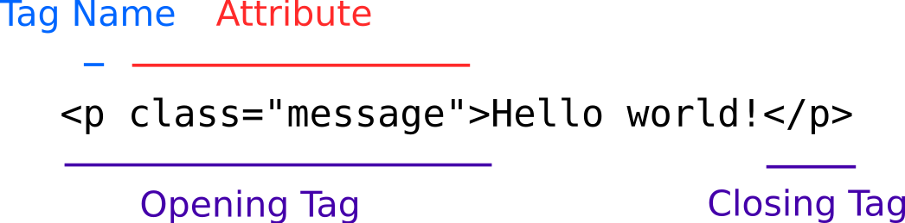

# Basic HTML

HyperText Markup Language, or HTML, is used to write the content of websites. Any text, images, inputs, outputs, and buttons are written in HTML files that have a `.html` extension. Every website should have at least one file called `index.html`, because this is what browsers will try to display by default when you go to a website.

## Anatomy Of An HTML Tag

There are two kinds of HTML tag:



---


* Tag name - These indicate what a tag means
* Attributes - These are properties of a tag that either configure it or further describe it
* Opening and closing tag - Most tags have an opening and closing pair that wrap the content they describe. Any attributes go inside the opening tag.
* Self-Closing tag - Some tags don't have closing tags and close themselves

All HTML is written inside one of these tags.

## HTML Tags

Here are some common HTML tags you will find useful in this workshop:

### `<h1>`

`<h1>` is a tag used to create headings. There should only be one of these per page.

```html
<h1>MadLibs</h1>
```

### `<p>`

This is a tag used for general text. The `p` stands for "paragraph."

```html
<p>It's a beautiful day in the neighborhood, a beautiful day for a neighbor. Could you be mine? Would you be mine?</p>
```

### `<input />`

`<input />`s are self-closing tags that collect user input.

```html
<input />
```

### `<label>`

By itself, an `<input />` is just a box for entering text. `<label>` is a tag that describes what should be entered into an `<input />`.

```html
<label for="name">Name</label>
<input id="name" />
```

It's important to connect labels with inputs for usability. Watch what happens when you click the label in [this example](https://codesandbox.io/s/brave-shape-hdnbg).

### `<button>`

`<button>` creates a button that users can press. You can use this to trigger something in JavaScript. The text you want to display inside the button should go in between the opening and closing tag.

```html
<button>Click Me!</button>
```

### `<output>`

When something has been processed with JavaScript, it can be printed to the screen with `<output>`. Note that unlike `<input />`, `<output>` has an opening and closing tag.

```html
<output>This text was put here by JavaScript.</output>
```

## HTML IDs

To access the contents of HTML tags with JavaScript, add IDs to them. IDs look like this:

```html
<input id="word-3-input" />

<output id="word-3-output">Word 3 goes here</output>
```

Note that `id` is all lowercase, with no space between `id`, `=`, the `"`, and the name you choose to give it.

## Nesting

HTML tags with opening and closing tags can be nested:

```html
<p>
  This is some text content
  <output>This is an output nested inside the p tag!</output>
</p>
```

Be sure to close tags in the same order you open them in. For example, this is not valid HTML:

```html
<p>
  This is some text content
  <output>This is an output nested inside the p tag!</p>
</output>
```

## HTML Style

### Case-Sensitivity

HTML is case-insensitive, which means that `<article>`, `<ARTICLE>` and `<Article>` will all work. However, it is conventional to write your HTML tags all lowercase.

### Indentation

While HTML is whitespace-insensitive (meaning that it ignores spaces and returns), inconsistent indentation makes it very difficult to read. For example, writing your code like this:

```html
<p><output>Some paragraph content here
  <input id="some-id" /></button>
```

Makes it difficult to tell that neither the `<p>` tag nor the `<output>` tag were closed, and that the `</button>` closing tag doesn't have a matching opening tag. Rewritten like this:

```html
<p>
  <output>
    Some paragraph content here
    <input id="some-id" />
    </button>
```

The mistakes are easier to see.

### Whitespace

Since HTML is whitespace-insensitive, it's often technically valid to leave lots of whitespace around your markup, like this: `< input id = " adjective-input " / >`. It is conventional to keep everything "trimmed": `<input id="adjective-input" />`.

## Watch Out!

Be careful of typographer's quotes! Most word processing programs like Word and Google Docs will substitute the `"` and `'` characters for `“`/`”` and `‘`/`’` characters (look for the curls). These are called typographer's quotes, and cannot be used for HTML attributes. Always write your code in a text editor, not in a word processor!

## Additional Resources

| Resource | Description |
| --- | --- |
| [MDN: Structuring the web with HTML](https://developer.mozilla.org/en-US/docs/Learn/HTML) | A popular beginner's tutorial on HTML. It covers many more HTML topics than this workshop. |
