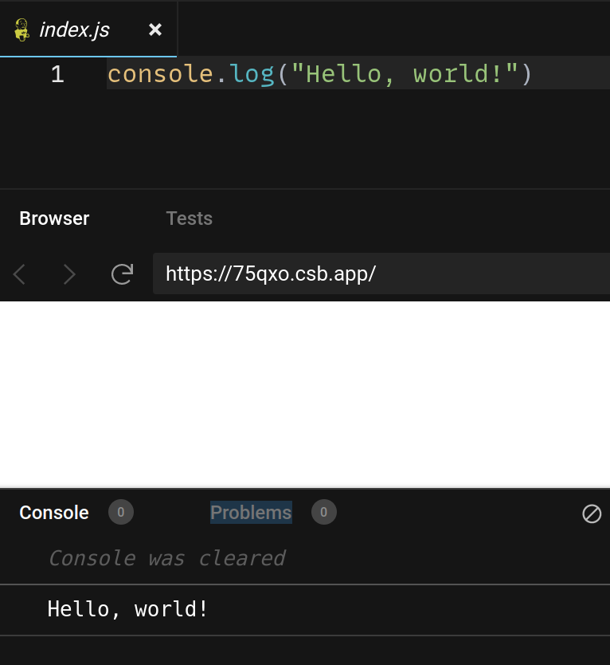
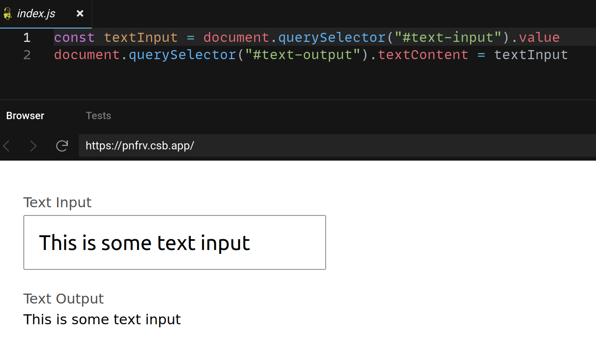
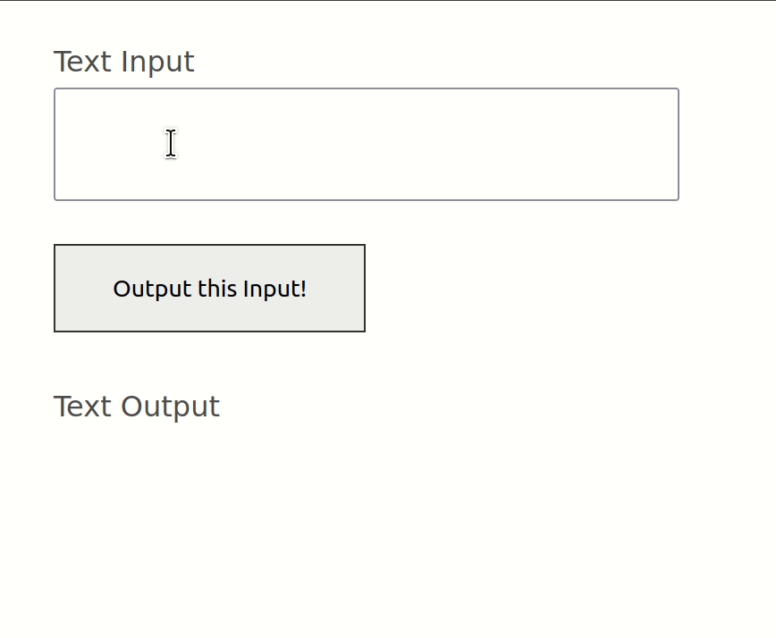

# Basic JavaScript

JavaScript, also called JS, is a programming language for adding actions to web pages. JavaScript can read and write any part of a web page, which is especially powerful when integrating user input (like forms), user interaction (like button presses), and data. JavaScript can be used to look up search results and display them on a page, subscribe users to a newsletter, power eCommerce sites, and much more.

## Logging

One of the easiest ways to inspect the results of JavaScript code is to log it:



[Play with this code](https://codesandbox.io/s/musing-snow-75qxo?file=/index.js)

When you `console.log()`, anything between the parentheses will be printed to the console. The console isn't the same thing as the screen; you have to specifically open the console and most users will not see content that you put here. It's primarily used to test your code and examine what different things do. To open up the console in a browser:

* Mac: ⌘ + ⇧ + `j`
* Windows and Linux: `Control` + ⇧ + `j`

## JavaScript Variables

JavaScript variables are containers that keep values.

```js
const firstName = "Carlos"
console.log(firstName) // Prints "Carlos"
```

Declare variables with `const`, give the variable a name, and then set it equal to a value. When saving words in variables, note that you need to wrap them in quotes. Be careful about which quotes you use! `""` is not the same as `‟”` (look at the curls). When you write in a word processor like Word or Google Docs, the software generally replaces the `'` and `"` characters with smart quotes. These won't work in programming, so always write code in a text editor instead of a word processor.

When a variable is multiple words, it's conventional to lowercase all of the first word and use uppercase for the first letter the other words. This is called camelCase.

## DOM Methods

DOM methods are tools for reading and writing web pages with JavaScript. Two common DOM methods:

* `document.querySelector("#some-input-id").value` - This reads the data a user has entered into an input field. In this example, the input has an ID of `some-input-id`, but it could be anything you choose. Note the `#` before the ID; these selectors work the same as selectors in CSS.
* `document.querySelector("#some-input-id").textContent = "This text will go on the page"` - To make text show up on the page, select the element and set its `textContent` equal to the text you want to display. You can write it out in quotes like this example, or can give it a variable.

```html
<label for="text-input">Text Input</label>
<input id="text-input" value="This is some text input" />

<label for="text-output">Text Output</label>
<output id="text-output"><output>
```



[Play with this code](https://codesandbox.io/s/brave-stallman-pnfrv?file=/index.js)

## JavaScript Functions

Functions are a way to group a multiple commands in JavaScript. You can save inputs to variables, read things from the web page, or write them to the web page inside of functions.

```js
// This part says what the function does
function substituteWords(){
  const textInput = document.querySelector("#text-input").value
  document.querySelector("#text-output").textContent = textInput
}

// This part actually executes it
substituteWords()

// And you use functions more than once
substituteWords()
substituteWords()
substituteWords()
```

One of the ways functions are used is in response to a user action, like a click. For example, if your HTML has a `<button>`:

```html
<label for="text-input">Text Input</label>
<input id="text-input" />
<button id="transform">Output this Input!</button>

<label for="text-output">Text Output</label>
<output id="text-output"><output>
```

You can get the button with a DOM method and give it a function to execute when its clicked:

```js
function substituteWords(){
  const textInput = document.querySelector("#text-input").value
  document.querySelector("#text-output").textContent = textInput
}

const button = document.querySelector("#transform")
button.onclick = substituteWords // No parentheses!
```



[Play with this code](https://codesandbox.io/s/friendly-mccarthy-hg0h8?file=/index.js)
