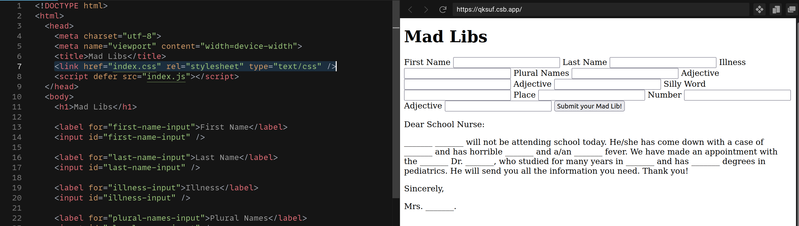

# MadLibs Overview

In this workshop, you'll create an interactive web application using HTML, CSS, and JavaScript.

## The Parts of a Web App

The content of your application (words, pictures, buttons, inputs, outputs) will be written in a language called HTML. HTML is a tool used to structure content in a way that makes it easy to style with CSS and make interactive with JavaScript.

The appearance of the content will be written in a language called CSS. CSS can see your HTML, and it determines how big, small, wide, tall, bold, and colorful to display your content.

The interaction of the application will be written in a language called JavaScript. In our application, JavaScript will read the words people enter into the MadLibs app, and put those words into a story when the button is clicked.

Check out this example of a [finished MadLibs app](https://madlibs-workshop.web.app). You can also [play with the code](https://codesandbox.io/s/sparkling-shadow-qksuf).

## Steps

1. Read through the final activity. This the goal, so keep referring back to it throughout the workshop.
2. Read the HTML lesson.
3. Do the HTML exercises.
4. Read the JavaScript lesson.
5. Do the JavaScript exercises.
6. Read the CSS lesson.
7. Do the CSS exercises.
8. Start building your own MadLibs app.
