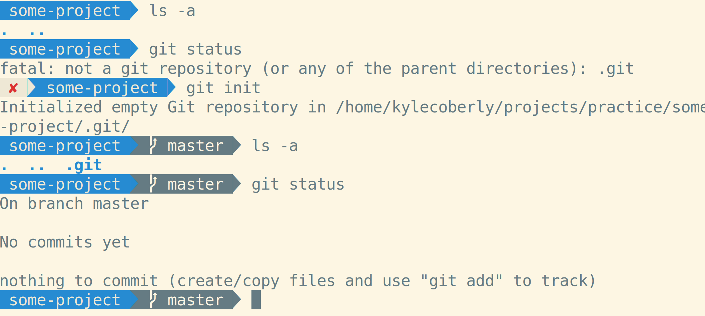
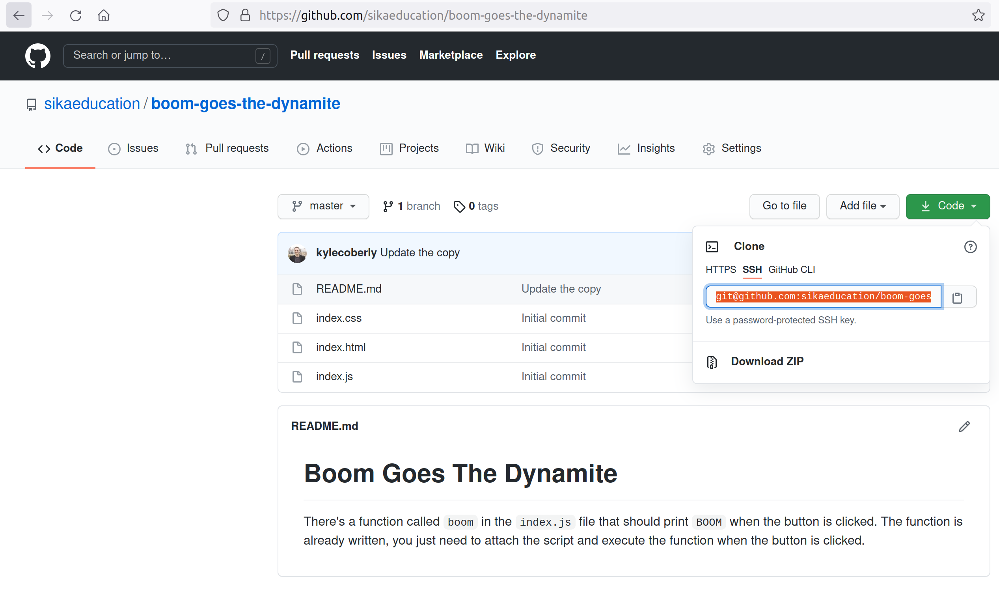
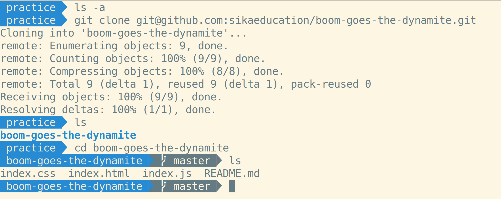

# Git: Repositories

A Git repository, or repo, is a folder that contains more than just files; it also contains every version of those files. Git offers many tools for inspecting those different versions, and even rolling back your files to one of them if necessary. Git does all of this very efficiently, so the file sizes of repos stay very small. This makes it feasible for everyone working with a repository to maintain a complete copy.

## Local Respositories

To make a local repository, run `git init`. This allows the `git` CLI program to run commands when you're in that folder:

Once a folder has become a Git repo, you can stage and commit files in it.

## GitHub Repos

If a repository already exists on GitHub, you copy it to your computer with `git clone`:

You can look at this code, make changes to it, or even use it as the basis for your own code without affecting the repository on GitHub that you cloned from.

It doesn't make a difference if a repository was started on your computer or on GitHub. Both places end up with a complete copy of the repository.

## Watch Out

* Technically, a Git repo is any folder that has a `.git` folder in it. Removing the `.git` folder removes the repository and its history, but leaves all the rest of the files in their current state.
* You may find that your repo includes files that you're not expecting it to, or you may find that something unexpected is a repository. This is often caused by having `.git` folders in more than one level of the same hierarchy.
  1. Run `ls -a` to see if you have a `.git` folder in your present directory
  2. If you do, run `rm -rf .git` to remove it
  3. Otherwise, run `cd ..` to move up a directory
  4. Repeat until you find a folder with a `.git` folder in it to remove

## Additional Resources

| Resource | Description |
| --- | --- |
| [Git: Getting a Git Repository](https://git-scm.com/book/en/v2/Git-Basics-Getting-a-Git-Repository) | Git's guide to Git repositories |
| [Atlassian: Setting up a repository](https://www.atlassian.com/git/tutorials/setting-up-a-repositoryGit) | Atlassian's guide to Git repositories |
