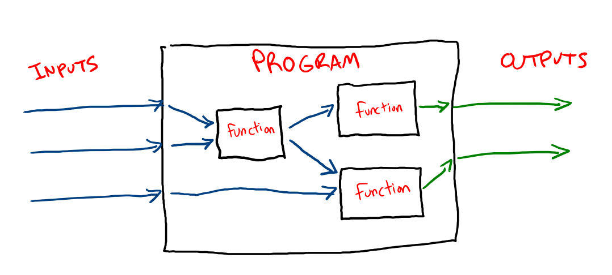

# Programming: Functions

Functions do two things:

* Make a set of code easier to reuse and repeat
* Transform inputs into an output

The second item should sound familiar because it's also what a program does. This is not a coincidence. In the process of transforming inputs into outputs, the problem may be split into smaller pieces:



You can think of many programs as being made up of smaller and smaller programs. For example, a function that title-cases a string:

```js
titleCase("hello, world!") // "Hello, World!"
```

The implementation of `titleCase` might use a function that splits a string into words, and another function that capitalizes the first letter:

```js
function splitIntoWords(someString){
  return someString.split(" ")
}

function capitalizeFirstLetter(word){
  const firstLetter = word[0]
  const capitalizedFirstLetter = firstLetter.toUpperCase()
  const restOfWord = word.slice(1)

  return capitalizedFirstLetter + restOfWord
}

function titleCase(someString){
  const words = splitIntoWords(someString)
  let capitalizedWords = []

  for (let word in words){
    const titleCasedWord = capitalizeFirstLetter(word)
    capitalizedWords.push(titleCasedWord)
  }

  const titleCasedString = capitalizedWords.join("")

  return titleCasedString
}

titleCase("hello, world!") // "Hello, World!"
```

This feature of functions lets you decompose big problems into small ones and reuse more of your work.

## Declaring functions

There are several ways to create a function in JavaScript, but the simplest looks like this:

```js
function nameOfFunctionGoesHere(parameters, go, here){
  // Body of the function goes here
  return "return value goes here"
}
```

* `function` - The `function` keyword identifies the code that comes after it as a function definition.
* `nameOfFunctionGoesHere` - This is the name of the function, and it's how the function will be referred to by other code.
* `(parameters, go, here)` - These are function parameters, which are variables given to the function when it's called. They're available throughout the body of the function.
* `{}` - This is the body of the function, and it holds the code that will run whenever the function is called.
* `return` - Any expression that follows the `return` keyword will be what a called function will evaluate to.

For example, in our `capitalizeFirstLetter` function:

```
function capitalizeFirstLetter(word){
  const firstLetter = word[0]
  const capitalizedFirstLetter = firstLetter.toUpperCase()
  const restOfWord = word.slice(1)

  return capitalizedFirstLetter + restOfWord
}
```

* The function is called `capitalizeFirstLetter`
* It takes a single parameter called `word` that will be available throughout the function body
* The function body has 4 statements that that uppercase the first letter of a word
* The function returns the word with the first letter capitalized

When the function is called with a word, it will evaluate to the word with the first letter capitalized.

```js
const greeting = capitalizeFirstLetter("hi!")
const status = capitalizeFirstLetter("warning")
const message = capitalize("wait")

console.log(greeting, status, message) // "Hi!", "Warning", "Wait"
```

## Calling Functions

Calling (also called invoking) a function means telling it to run.

```js
// This defines the function
function sayHelloWorld(){
  console.log("Hello, world!")
}

// This calls the function 3 times
sayHelloWorld() // prints "Hello, world!" to the screen
sayHelloWorld() // prints "Hello, world!" to the screen
sayHelloWorld() // prints "Hello, world!" to the screen
```

You can also call a function with a value that can be used inside the function:

```js
function saySomething(message){
  console.log("Hello, " + message)
}

saySomething("Frank") // Prints "Hello, Frank" to the screen
saySomething("Mabel") // Prints "Hello, Mabel" to the screen
```

In this example, `message` is a parameter of the function, and `"Frank"` and `"Mabel"` are arguments to the function.

## Return values

Functions often (but don't have to) return a value.

```js
function getCompanyName(){
  return "Company Name Here"
}

const companyName = getCompanyName()
console.log(companyName) // "Company Name Here"
```

The return value of a function is what calling them function will evaluate to. For example, since the `getCompanyName` function has a return value of "Company Name Here", you can use `getCompanyNameHere()` anywhere you want to use that string. For example:

```js
console.log("Congratulations on your first day at " + getCompanyNameHere())
```

## Parameters and Arguments

### Parameters

The variables that are passed into a function definition are called parameters:

```js
function double(number){
  return number * 2
}
```

In this example, `number` is a parameter. You can pass more than one parameter into a function by separating them with commas:

```js
function add(number1, number2){
  return number1 + number2
}
```

In this example, `number1` and `number2` are parameters.

### Arguments

When you call a function, you give it arguments:

```js
double(someNumber)
add(someNumber, 5)
```

In this example, `someNumber` and 5 are both arguments. You can think of parameters as the theoretical way something will be used and arguments as the actual for how something will be used.

## Watch Out!

Returning a value from a function does not output anything to the screen. This program doesn't output anything:

```js
function getName(){
  return "Kevin"
}
getName()
```

To output something to the screen, you'd have to use `console.log`. You could either do that this way:

```js
function printName(){
  console.log("Kevin")
}
printName()
```

Or this way:

```js
function getName(){
  return "Kevin"
}
console.log(getName())
```

The advantage of the second way is that by separating out getting the name from printing the name, you can use the `getName` function for other things like building another string.

It's easy to confuse returning a value from a function with printing something to the screen. This returns:

```js
function getGreeting(){
  return "Hi, how are you today?"
}
```

This prints something to the screen:

```js
function printGreeting(){
  console.log("Hi, how are you today?")
}
```

This difference becomes apparent when you save the result of a function call into a variable:

```js
const greeting = getGreeting()
const nothing = printGreeting()

console.log(greeting) // "Hi, how are you today?"
console.log(nothing) // Undefined
```

`greeting` is equal to `"Hi, how are you today?"` because that's what the `getGreeting` function returns when its called. The `printGreeting` function doesn't return anything.


## Additional Resources

| Resource | Description |
| --- | --- |
| [Video: JavaScript Functions](https://www.youtube.com/watch?v=N8ap4k_1QEQ) | Programming With Mosh's guide to functions |
