# CLI: File Management

In a graphical file manager, you double-click to open files, drag them into new folders, and use key commands and context menus to delete and rename files. You can efficiently do all of these tasks and more on the command line.

## Files

Everything in the CLI is either a file or a directory, which is also called a folder. Directories work exactly like the ones used with graphical file manages in Windows and MacOS, as do all the typical files such as text documents, images, and music. Things like programs and user input are also represented by files. For the most part, the file extension characters at the end of a file (like `.txt`, `.js`, `.md`, `.zip`) are just part of the name and carry no other meaning. Files and folders that start with a `.` (like `.bashrc` and `.ssh`) are considered hidden and are only displayed if you explicitly ask for them.

## Creating Files

To create a blank file, use the `touch` command:

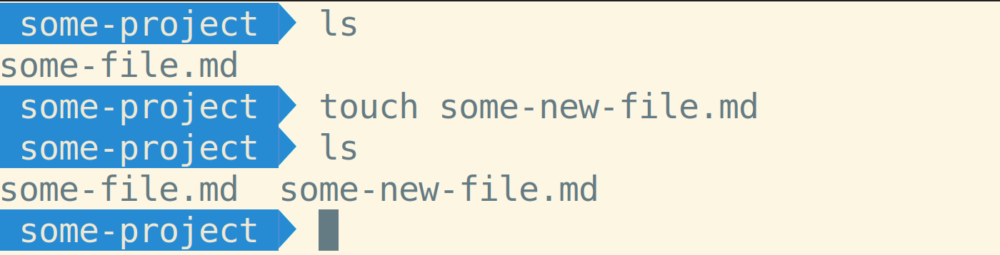

The touch command was originally intended to update the _last modified_ time of a file. If the file doesn't exist, it creates it.

## Creating Directories

To create an empty directory, use the the `mkdir` command:

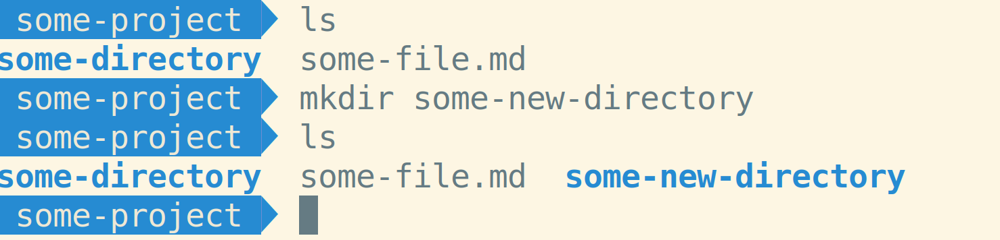

## Reading files

To see the contents of a file, use the `cat` command.

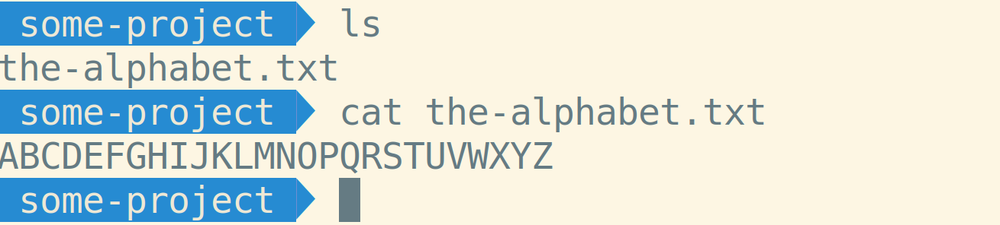

`cat`, short for _concatenate_, was designed to be used to print the combined contents of a multiple files. If you only give it one file though, it prints the contents of the file to the screen.

## Moving files and folders

To move a file or folder, use the `mv` command:

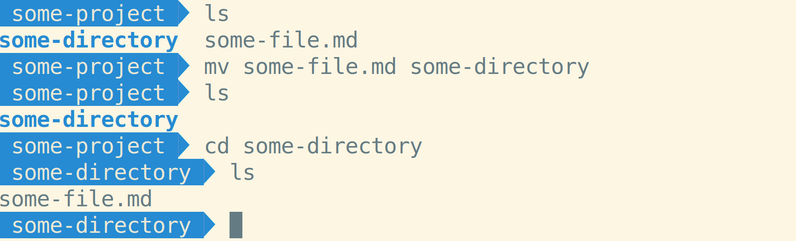

`mv` takes two arguments:

* The absolute or relative path of the file you want to move
* An absolute or relative path to the directory you want to move the file to

## Renaming files and folders

To rename a file, use the `mv` command:

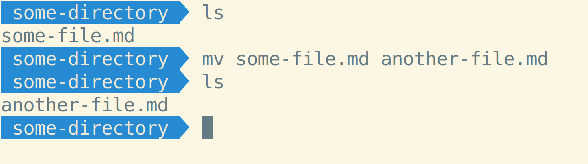

This is the same command used to move files. If you the path you're moving the file to is in a different directory, it will move it there. If the path you're moving the file to is in the same directory, it will rename the file. You can combine these to move and rename a file at the same time:

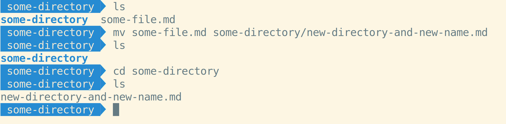

## Copying files and folders

To copy a file, use the `cp` command:

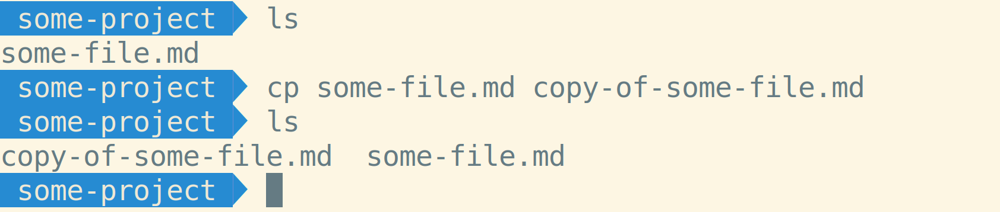

To copy a folder, you need to add the `-r` (_recursive_) flag:

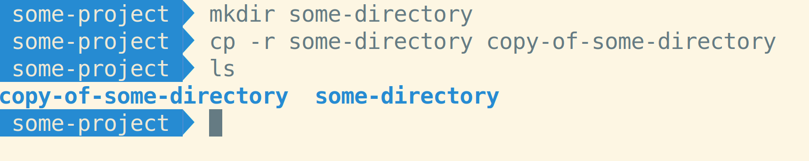

## Deleting files and folders

To delete a file, use the `rm` command:

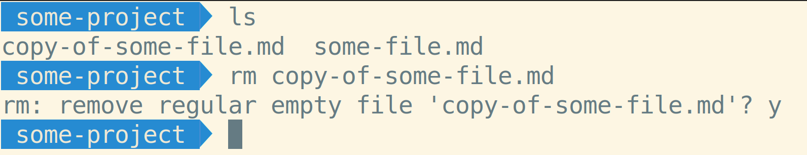

To delete a folder, use the `-r` (_recursive_) flag:

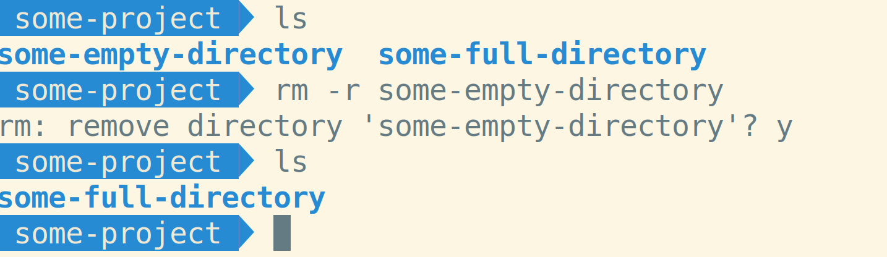

Note that this only works if the directory doesn't have any files in it. To delete a folder _and_ its contents, you need to add the `-f` (_force_) flag:

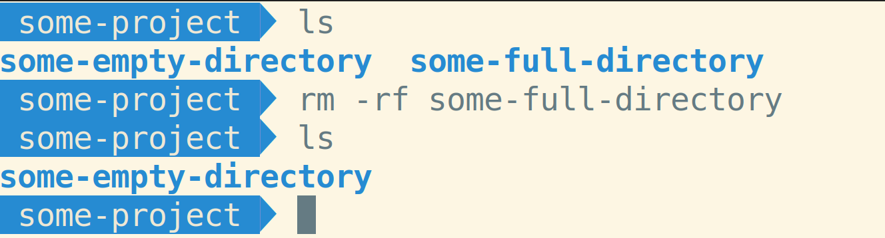

## Watch Out!

* Be careful using `/`. Any path that starts with `/` is an absolute path. So, `mv old new` takes a file called `old` and renames it `new`, but `mv old /new` takes a file called `old`, moves to the root directory, and renames it `new`.
* `rm` is a very dangerous command. By default, you will not be prompted to ask if you're sure you want to delete something, which means you can accidentally entire projects and even large parts of your computer by not using it carefully. You can use the `-i` flag (_interactive_) to make the CLI prompt you to ask if you're sure you want to delete something.
