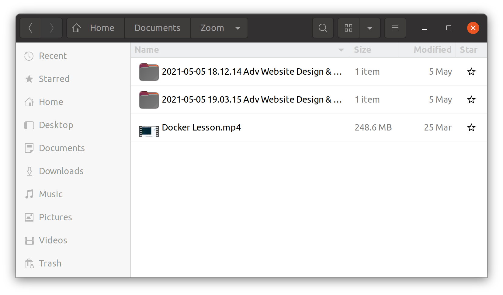
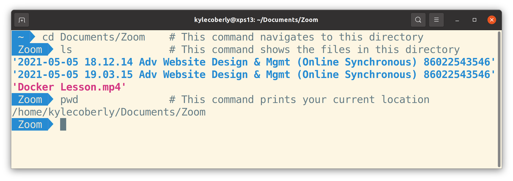
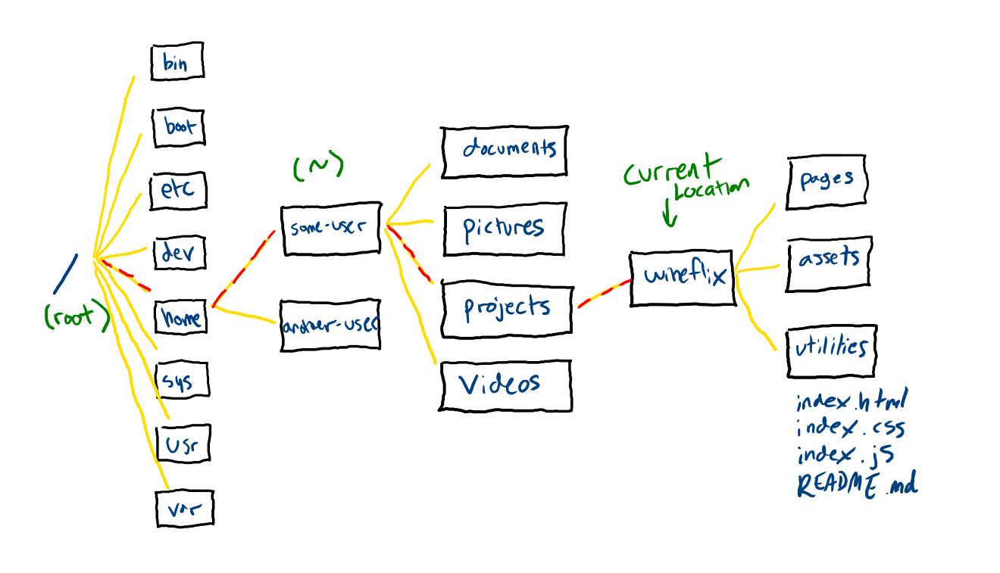

# CLI: Navigation

In a graphical file manager, you navigate the file system by double-clicking on folders and using the back or up buttons. Your current location is usually showed as breadcrumbs.



In the CLI, you navigate and find your current location by entering commands.



## Absolute and Relative Paths

There are two ways to describe any location.

An absolute path starts with `/` and describes how to get to a location from the root directory. In this directory structure, if you're in the `wineflix` folder:



* The absolute path to this location is `/home/some-user/projects/wineflix`.
* The relative path to this location is `.`

Without moving from the `wineflix` directory:

* The absolute path to the `pages` directory is `/home/some-user/projects/wineflix/pages`
* The relative path to the `pages` directory from the `wineflix` directory is `./pages`

You can describe directories above your current directory with `..`:

* The absolute path to the `pictures` directory is `/home/some-user/pictures`
* The relative path to the `pages` directory from the `wineflix` directory is `../../pictures`

Lastly, you can describe locations relative to your home directory by using `~`:

* The absolute path to the `documents` directory is `/home/some-user/documents`
* This path can also be written as `~/documents`

Entering paths correctly by hand is tedious and error-prone. Luckily, you can use tab completion to help you out. If you enter a couple of characters for the path you want and press `Tab`, the terminal will try to complete the rest of the path for you. If there's more than one possible match, you can press `Tab` repeatedly to cycle through options. This accomplishes two things: It saves you time typing, and it also ensures that the file or folder you're looking for actually exists. If the terminal can't tab complete a path, you're probably not in the right place.

## Finding out where you are

To see the absolute path to your current location, run `pwd`:

```bash
pwd
/users/username-goes-here
```

## Finding out what's in a directory

To see the files in a directory, use `ls`:

```
ls
some-directory some-file.md some-other-file-md
```

You can use the `-l`, or long listing, flag to see all the files and folders listed one-per-line, as well as other information about them:

```
ls -l
total 3
drwxrwxr-x 2 username-here username-here 4096 Jul  3 10:12 some-directory
-rw-rw-r-- 1 username-here username-here   23 Jul  3 10:13 some-file.md
-rw-rw-r-- 1 username-here username-here   23 Jul  3 10:13 some-other-file.md
```

You can use the `-a`, or all, flag to see all files including hidden files, which are files that start with a `.`:

```
ls - a
. .. .some-hidden-directory .some-hidden-file some-directory some-other-directory some-file.md some-other-file-md
```

You can even combine the two:

```
ls -la
total 7
drwxrwxr-x 2 username-here username-here 4096 Jul  3 10:12 .
drwxrwxr-x 2 username-here username-here 4096 Jul  3 10:12 ..
drwxrwxr-x 2 username-here username-here 4096 Jul  3 10:12 .some-hidden-directory
-rw-rw-r-- 1 username-here username-here   23 Jul  3 10:13 .some-hidden-file.md
drwxrwxr-x 2 username-here username-here 4096 Jul  3 10:12 some-directory
-rw-rw-r-- 1 username-here username-here   23 Jul  3 10:13 some-file.md
-rw-rw-r-- 1 username-here username-here   23 Jul  3 10:13 some-other-file.md
```

## Navigating

To navigate in a shell, use the `cd` command to change directory and give it any relative or absolute path.


To move from the `wineflix` directory to the `videos` directory, you could run:

```bash
cd ../../videos
```

Or by absolute path:

```bash
cd /home/some-user/videos
```

Or by home-relative path:

```bash
cd ~/videos
```

To move from the `wineflix` directory to the `assets` directory, you could run:

```bash
cd assets
```

Here are some more navigation examples:

```bash
cd ..                                               # Move up a directory
cd ../some-folder/some-other-folder                 # Move up a directory, then into "some-folder", then "some-other-folder."
cd some-folder                                      # Move into "some-folder"
cd some-folder/some-other-folder/yet-another-folder # Navigate into "some-folder", then "some-other-folder", then "yet-another-folder"
cd /                                                # Move to the root directory
cd /home/user-name-here                             # Move to your home directory
cd ~                                                # Move to your home directory
cd ~/some-folder                                    # Move to your home directory, then "some-folder"
```

## Watch Out!

*You can only `cd` into folders, not files.

## Additional Resources

| Resource | Description |
| --- | --- |
| [MDN: Navigation on the Command Line](https://developer.mozilla.org/en-US/docs/Learn/Tools_and_testing/Understanding_client-side_tools/Command_line#navigation_on_the_command_line) | Navigation on the Command Line |
