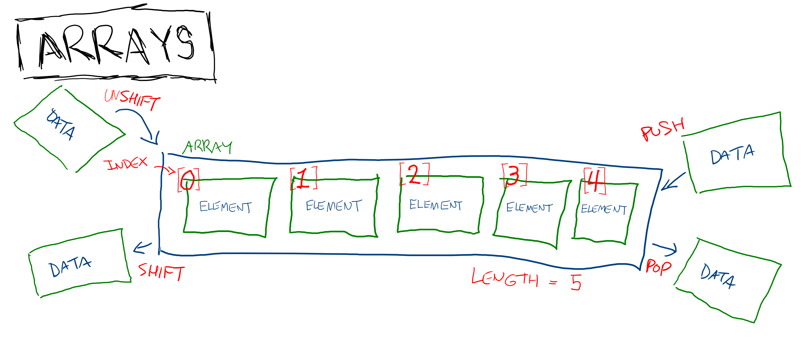

# Introduction to Data Structures

The first concept to explore in computer science is data structures. You've actually already encountered one already in JavaScript- the array. A data structure is a pattern for organizing, managing, and storing data in a computer. In practice, this means defining operations that a data structure can perform and data that it exposes. For example, an array:

* Stores a collection of data, usually of the same data type. Each item in the collection is called an element.
* The order that elements are stored in is important
* You can randomly access any element of an array by its index
* You can add an element to the end of an array with a method called `push`
* You can remove an element from the end of an array with a method called `pop`
* You can add an element to the beginning of an array with a method called `shift`
* You can remove an element from the beginning of an array with a method called `unshift`
* You can see how many elements are in the array with a property called `length`

All of these facts about arrays are independent of arrays in JavaScript. They also apply to arrays in C, Java, PHP, Ruby, Python, and any other language that uses them. They are an "abstract data type" that gets a concrete implementation in each of those languages.

There are lots of other data structures, but very few of them are used directly in JavaScript. The ideas behind those data structures are used often though and will help you understand many computing concepts better and give you more tools to solve problems with.

## Watch Out!

A data structure is not the same thing as a data type. A string is a data type and it's used in data structures, but it's not a data structure itself. Data structures are made up of different data types (which are called "primitives").

## Additional Resources

| Resource | Description |
| --- | --- |
| [Video: What Are Data Structures?](https://www.youtube.com/watch?v=bum_19loj9A) | CS Dojo's intro to data structures |
