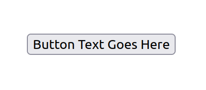
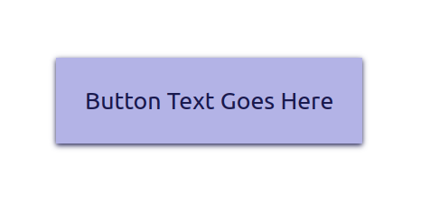

# HTML: Buttons

Once you're comfortable working with the DOM and events, you can start using one of the most practical means of interaction: HTML buttons.

```html
<button id="agreement">Click to Agree to Terms</button>
```

```js
const agreementButton = document.querySelector("#agreement")
let isAgreed = false
agreementButton.addEventListener("click", event => {
  isAgreed = true  
})
```

The example defaults the `isAgreed` variable to `false` when the page loads, and whenever the `agreementButton` is clicked, that variable is set to `true`. This can be read by other functions to determine whether or not the document has been agreed to yet.

## Button Styling

Buttons have one of the more distinctive default browser styles:



These are the properties you want to override to make butons look consistent across browsers:

* `padding`
* `border`
* `background-color`
* `color`
* `box-shadow`

Using this CSS:

```css
button {
  padding: 16px;
  border: none;
  background-color: hsl(240, 50%, 80%);
  color: hsl(240, 50%, 20%);
  box-shadow: 0 1px 3px hsl(240, 50%, 20%);
}
```

The same button will look like this:



## Watch Out!

Semantics still matter with buttons. Many elements can look button-like (such as checkboxes and navigation links), but a `<button>` element is specifically for issuing commands.

## Additional Resources

| Resource | Description |
| --- | --- |
| [MDN: `<button>`](https://developer.mozilla.org/en-US/docs/Web/HTML/Element/button) | MDN's reference on the `<button>` element |
