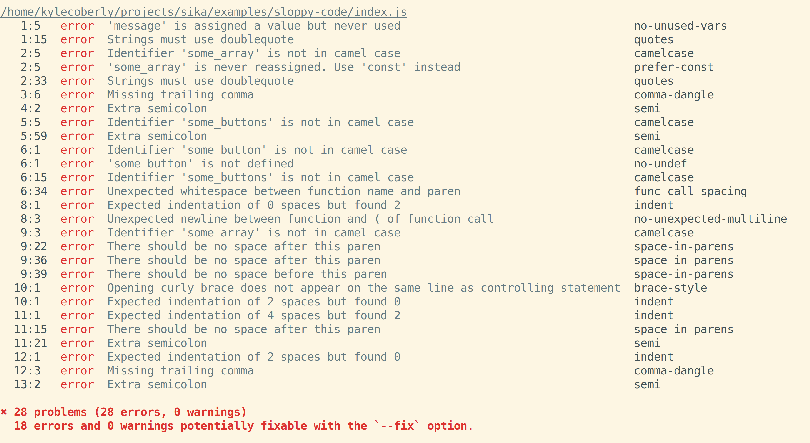

# Linting

This code will run without errors:

```js
var message = 'A message'
let some_array = ["first item", 'second item', `third
item`
];
var some_buttons = document.getElementsByTagName("button");
some_button = some_buttons[  0  ]

  (
  some_array.forEach(   function  (  x  )
{
  console.log(    x);
})
);
```

It also has lots of problems:

* It uses the older `var` instead of the newer `let`/`const`
* `let` is used on a variable that isn't reassigned
* It uses snake_case for variable names instead of camelCase
* It uses single quotes, double quotes, and backticks inconsistently
* It uses semicolons inconsistently
* It has inconsistent line breaks
* It has inconsistent spacing around parentheses and brackets
* It has inconsistent indentation
* It has an unscoped variable (`some_button`) that doesn't use `var` / `let` / `const`, which makes it globally scoped
* It has variables that are declared and never used
* It uses `.getElementsByTagName` instead of `document.querySelector`
* It has more parentheses than it needs

These aren't bugs, but they do make the code hard to read and they certainly may lead to bugs as a result.

## Linting

Linting tools analyze your code and point out style problems:



Most of them will also do this in real-time, integrated into your text editor, and can even fix problems for you as you type.


After running the above code through a linter and fixing the errors, you may get something more like this:

```js
const someArray = ["first item", "second item", "third item"];
someArray.forEach(x => console.log(x));
```

## Linting Style Guides

There are many linting style guides available, each of which is characterized by a collection of rules. Some examples of rules:

* All strings must use single quotes, unless the string contains single quotes or include a template literal
* When functions are declared, there should be one space after the `function` keyword
* All arrays should have a trailing comma at the end of the list
* No line should be longer than 80 characters

You can configure a linter to use any combination of rules it supports, and can even control whether or not the linter should warn you (let you know that it happened but otherwise leave it alone) or throw an error (attempt to fix it).

Combinations of rules are published as style guides. Some companies and teams adopt a custom style guide so that all the code written in their company is consistent, and others reuse popular existing ones such as:

* AirBnB
* Standard
* Google

Even when using someone else's style guide, you can add or override your own rules.

## Watch Out!

* Strictly speaking, things like indentation and semicolon usage are classified as _formatting_ and things like naming conventions and language features you should or shouldn't use are _linting_. Both of them are commonly referred to as linting collectively.
* Linters will conveniently also catch most syntax errors, such as missing closing brackets

## Additional Resources

| Resource | Description |
| --- | --- |
| [Wikipedia: Lint](https://en.wikipedia.org/wiki/Lint_(software)) | Wikipedia's article on linting |
