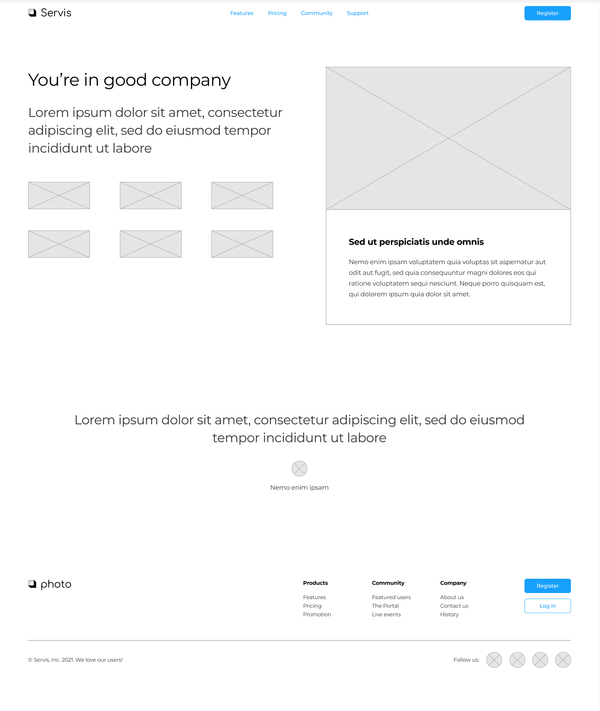

# Servis

Servis is a new service being offered for the brand you've been given. Use the follow content to implement your design.

## Brand Name

Servis

Create a simple wordmark logo for Servis using a display font.

## Primary Navigation

* Features - Goes to /features.html
* Pricing - Goes to /pricing.html
* Community - Goes to /community.html
* Support - Goes to /support.html
* Register - Goes to /register.html

## Pitch

Tagline: "You're in good company"

"With locations in over 30 cities, you're never far from outstanding Servis."

Images

* 1.jpg
* 2.jpg
* 3.jpg
* 4.jpg
* 5.jpg
* 6.jpg

## Highlight Box

Image: 7.webp

Heading: "Stacey's Story"

"Stacey was frustrated with how slow her previous work had been. Her previous company had ignored her repeated requests to fix their work. After one call to Servis, her problems were taken were taken care of immediately and now she's even better off than she was before."

## Testimonial

* "I was amazed by how simple and easy this could really be. Thanks Servis!"
* Image (customer.jpg)
* "Sarah Peters"

## Footer

Copyright notice: "© Servis Inc. 2021. We love our users!"

Navigation:

* "Product"
  * "Features" - Goes to "/features.html"
  * "Pricing" - Goes to "/pricing.html"
  * "Promotion" - Goes to "/promo.html"
* "Community"
  * "Featured users" - Goes to "/featured-users.html"
  * "The Portal" - Goes to "/the-portal.html"
  * "Live events" - Goes to "/live-events.html"
* "Company"
  * "About us" - Goes to "/about-us.html"
  * "Contact us" - Goes to "/contact-us.html"
  * "History" - Goes to "/history.html"

"Register": Goes to "/register.html"
"Log in": Goes to "/register.html"

Social media: "Follow us:"

* Twitter: https://twitter.com/fake
* Facebook: https://facebook.com/fake
* Instagram: https://instagram.com/fake
* LinkedIn: https://linkedin.com/in/fake

## Attribution

Pictures courtesy of [Generated Photos](https://generated.photos/)
