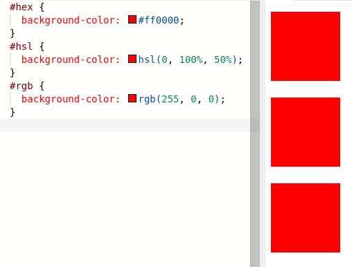
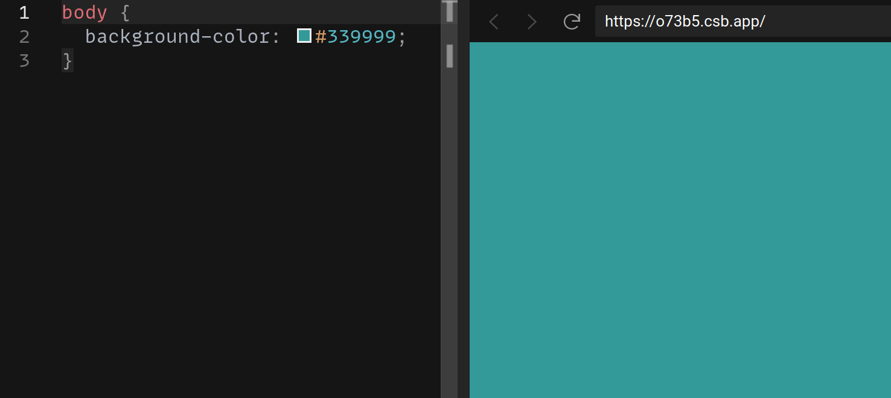
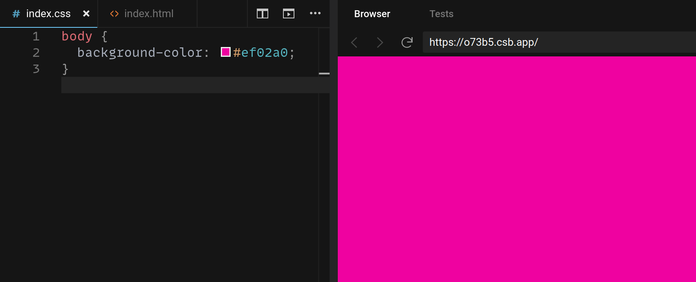
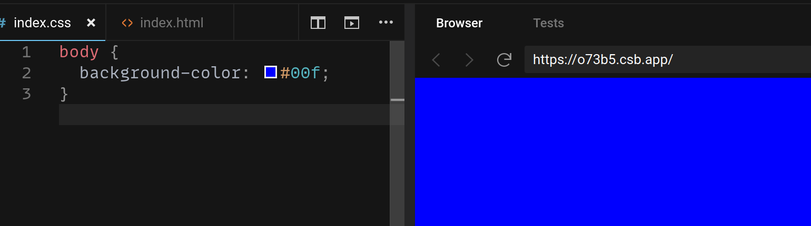
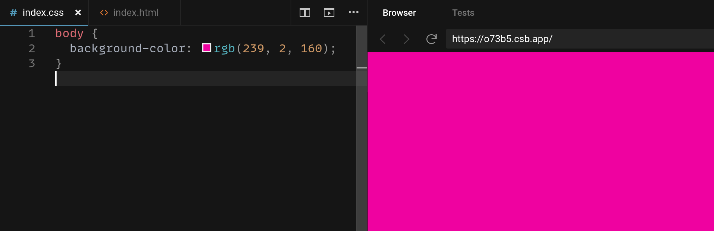

# CSS: Colors

There are a few different color formats, and you need to be conversant with all of them. You'll see them in tutorials, in design documents you're given by other developers, and in external tools you use. For example, all of these are the same color:



[Play with this code](https://codesandbox.io/s/ecstatic-sun-qdulk?file=/index.css)

There are a three common ways colors are represented in CSS: Hexadecimal, RGB, and HSL.

### Hexadecimal

Hexadecimal (also called hex) codes describe colors in terms of how much red, green, and blue is present in the color.



This color has a small amount of red and moderate amounts of blue and green, creating a teal color.

A hex number ranges from 0 to 15, but it represents it as a single character by using the first 6 characters of the alphabet. That means counting in Hexadecimal would go 0, 1, 2, 3, 4, 5, 6, 7, 8, 9, a, b, c, d, e, f. After f, you start over again, so counting from "16" would go 10, 11, 12, 13, 14, 15, 16, 17, 18, 19, 1a, 1b, 1c, 1d, 1e, 1f. This means that the amount of each color ranges from 0 (00) to 255 (ff).

CSS hex colors start with a `#`, like this: `#ef02a0`. This is equal to:

* Amount of red: ef (same as 239 in decimal)
* Amount of green: 02 (same as 2 in decimal)
* Amount of blue: a0 (same as 160 in decimal)

The result will a red-heavy purple:



You can also use hex colors with 3 characters (with less precision): `#00f`. This will result in a pure blue:



This is commonly used with black (#000), white (#fff), and many pure grays (#333, #666, and so on).

## RGB

RBG colors work exactly the same as hex colors, except they use regular decimal numbers between 0 and 255:

```css
color: rgb(0, 0, 0); /* Black */
color: rgb(255, 255, 255); /* White */
color: rgb(0, 255, 0); /* Pure green */
color: rgb(239, 2, 160); /* Red-heavy puple */
```

The hex code for the red-heavy purple, `#ef02a0`, broke down as:

* Amount of red: ef (same as 239 in decimal)
* Amount of green: 02 (same as 2 in decimal)
* Amount of blue: a0 (same as 160 in decimal)

Writing it as `rgb(239, 2, 160)` results in the same color:



There's no good reason to use hex codes for colors over RGB in most cases. That said, hex codes are commonly used throughout the web, so it's important to be able to read them.

## HSL

RBG is an improvement on Hex, but it's still very difficult to do "color math" in your head with, or to imagine what a color looks like just by looking at the numbers. HSL uses the "hue, saturation, and light" model.

* Hue: Degrees of a circle- 0 is red, as is 360. 120 is green, 240 is blue, they transition smoothly between.
* Saturation: 100% is fully saturated, 0% is grayscale.
* Lightness: 100% is white, 0% is black (regardless of the hue or saturation), 50% is moderate lightness.

```css
color: hsl(0, 100%, 50%); // Pure red
color: hsl(0, 0%, 100%); // White
color: hsl(100, 67%, 100%); // Aslo white
color: hsl(0, 0%, 0%); // Black
color: hsl(100, 67%, 0%); // Also black
color: hsl(350, 50%, 50%); // A red-heavy purple
```

HSL is great because when you need to tweak a color or build a pallette, it's much easier to work with. For that reason, HSL is a good default color model to use.

## Watch Out!

* The exact same color doesn't necessarily render identically in every browser
* Just because you have a color in one format doesn't mean you can't convert it to another format. All of the color formats support approximately all the same colors.

## Additional Resources

| Resource | Description |
| --- | --- |
| [MDN: Color](https://developer.mozilla.org/en-US/docs/Web/CSS/color) | MDN's overview of colors |
| [MDN: Applying Color](https://developer.mozilla.org/en-US/docs/Web/HTML/Applying_color) | MDN's tutorial on the colors |
| [Video: Are You Making This Mistake With CSS Colors?](https://www.youtube.com/watch?v=EJtmfkKulNA) | Web Dev Simplified's guide to CSS colors |
