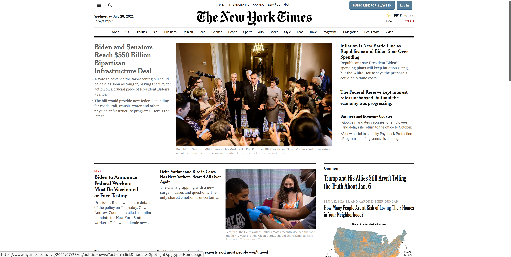
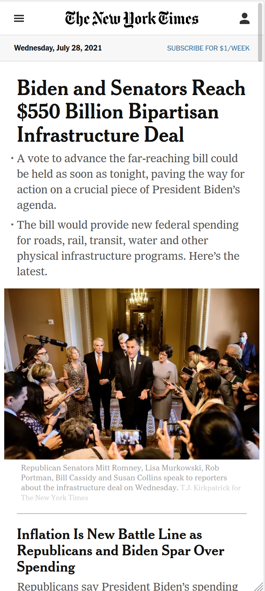
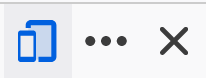
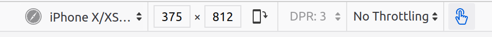

# CSS: Media Queries

Let's say you have a page that looks like this on a laptop:



But you want it to look like this on a phone:



How can you write CSS to accomodate this difference?

## Media Queries

Media queries allow you to write styles that only apply in certain situations. For example:

```css
@media (max-width: 300px) {
  p {
    color: red;
  }
}
```

This will make the text of all paragraphs red, but only if the screen is less than 300px wide. Media queries are commonly used to override a default style:

```css
p {
  color: blue;
}
@media (max-width: 300px) {
  p {
    color: red;
  }
}
```

This will make all paragraphs blue, unless the screen is less than `300px` wide, in which case they will be red.

`max-width` and `min-width` are the most common things to query, but there are others:

* **`screen`, `print`, and `speech`**: Target specifically those three classes of device, which is useful for hiding things from screen readers or removing elements for print
* **`orientation`**: Whether the width is greater than the height or the other way around
* **`resolution`**: The pixel density of the device

You can also combine multiple media queries with `and` and `not`:

```css
@media (min-width: 300px) and (max-width: 600px) {
}
@media (min-width: 300px) and not (print) {
}
```

## Responsive Design

Media queries are a powerful way to override specific styles for mobile. For example, we might want to constrain the width of something on a large screen, while overriding it to use the entire space on a small screen:

```css
p {
  width: 200px;
}

@media (max-width: 350px){
  p {
    width: 100%;
  }
}
```

A common strategy is to make your default style mobile and then add media queries for each breakpoint larger than that. Alternatively, you can make the default match the largest design and then add media queries for each breakpoint smaller than that. Start with the mobile-first strategy and experiment with both.

## Testing Responsive Designs

Browser dev tools have responsive design emulators that allow you to see the viewport size for screens:



When this tool is enabled, it gives you options to setting the dimensions and orientation of a target device:



## Watch Out!

* It's tempting to try to make breakpoints based on common device sizes. Instead, make your breakpoints independent of any particular device and make them based on when the design needs it.
* Each individual query needs to wrapped in `()`
* Media queries look like CSS rules because they are wrapped in `{}`- don't forget that you still need to use CSS selectors inside of them

Styles are still applied first-to-last. So this works as expected:

```css
p {
  width: 200px;
}

@media (max-width: 350px){
  p {
    width: 200px;
  }
}
```

But this will always be 200px, because the second rule overrides the first:


```css
@media (max-width: 350px){
  p {
    width: 200px;
  }
}

p {
  width: 200px;
}
```

## Additional Resources

| Resource | Description |
| --- | --- |
| [CSS Tricks: Media query guide](https://css-tricks.com/a-complete-guide-to-css-media-queries/) | CSS Tricks' media query guide is an excellent resource for the different uses of media queries. |
| [MDN: Media query reference](https://developer.mozilla.org/en-US/docs/Web/CSS/Media_Queries/Using_media_queries) | MDN's official media query reference |
| [MDN: Media query tutorial](https://developer.mozilla.org/en-US/docs/Learn/CSS/CSS_layout/Media_queries) | MDN's official media query tutorial |
| [Video: Learn CSS Media Query in 7 Minutes](https://www.youtube.com/watch?v=yU7jJ3NbPdA) | Web Dev Simplified's guide to media queries |
