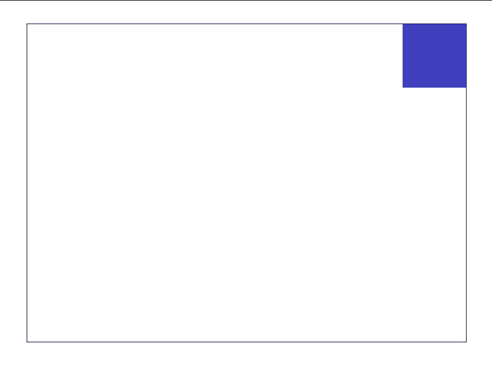
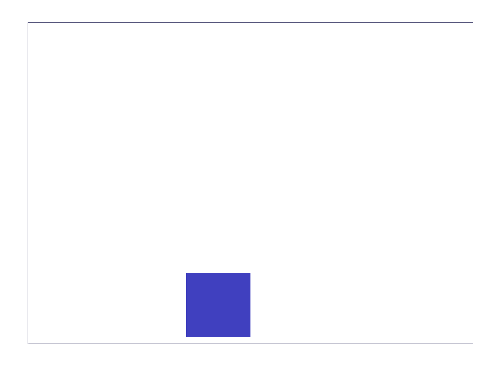
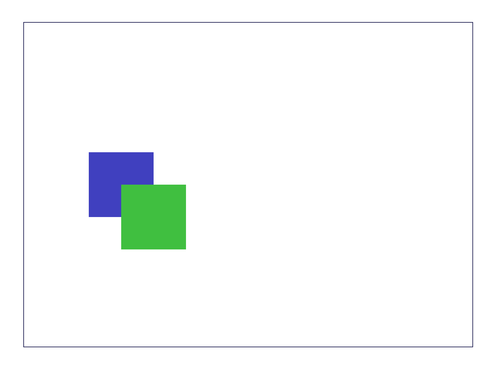

# CSS: Positioning

The `display` property has limits- you can only say that something should be inline or block. What if you want to tuck an element into a corner, or make it slightly off-center, or make elements overlap?





You can use CSS positioning:

```css
.container {
  position: relative;
}

.item {
  position: absolute;
  right: 0;
  top: 0;
}
```

[Play with this code](https://codesandbox.io/s/wonderful-moon-jzcd2?file=/index.css)

## Positioning

Positioning is another intimidating part of CSS, but it follows a small number of rules:

1. Every element starts as being statically positioned, which means it follows its normal inline or block placement.
2. You can make an element absolutely positioned, which means that you are overriding its normal placement and choosing to manually control exactly where it goes
3. When you absolutely position an element, it's rendered relative to either:
  a. Its nearest ancestor that has a `position` of something other than `static`
  b. The entire document

If you want to put something in the bottom-right corner of a the entire page, you can apply this style rule:

```css
.badge {
  position: absolute;
  bottom: 0;
  right: 0;
}
```

If you want to put something in the upper right corner of a containing element, you can apply this style rule:

```css
.card {
  position: relative;
}
.close {
  position: absolute;
  top: 6px;
  right: 6px;
}
```

Values given to `top`/`right`/`bottom`/`left` indicate how much space should be between the element you're positioning and its positioning context. It may be helpful to think of it as "pushing". An absolutely positioned element with a `left` value of `5%` would push the element 5% of the size of the positioning context from the left side.

## Watch Out!

* The `top`, `right`, `bottom`, and `left` CSS properties only work on absolutely positioned elements. They have no effect on elements with other positioning modes.
* Absolutely positioning an element makes that element a new relative context for any of its children.
* Absolutely positioned elements no longer take up any space in the document flow, meaning they can't push things out of the way. Elements will over- and underlap absolutely positioned elements. To control which order elements stack in, you can use the `z-index` property. Higher numbers go on top, lower numbers go on bottom.

## Additional Resources

| Resource | Description |
| --- | --- |
| [CSS Tricks: Positioning guide](https://css-tricks.com/snippets/css/a-guide-to-flexbox/) | CSS Tricks' positioning guide is an excellent resource for the different positioning modes. |
| [MDN: Positioning Reference](https://developer.mozilla.org/en-US/docs/Web/CSS/position) | MDN's official reference for CSS positioning |
| [MDN: Positioning Tutorial](https://developer.mozilla.org/en-US/docs/Learn/CSS/CSS_layout/Positioning) | MDN's official tutorial for CSS positioning |
| [Video: Learn CSS Position in 9 Minutes](https://www.youtube.com/watch?v=jx5jmI0UlXU) | Web Dev Simplified's guide to CSS positioning |
