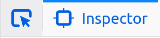
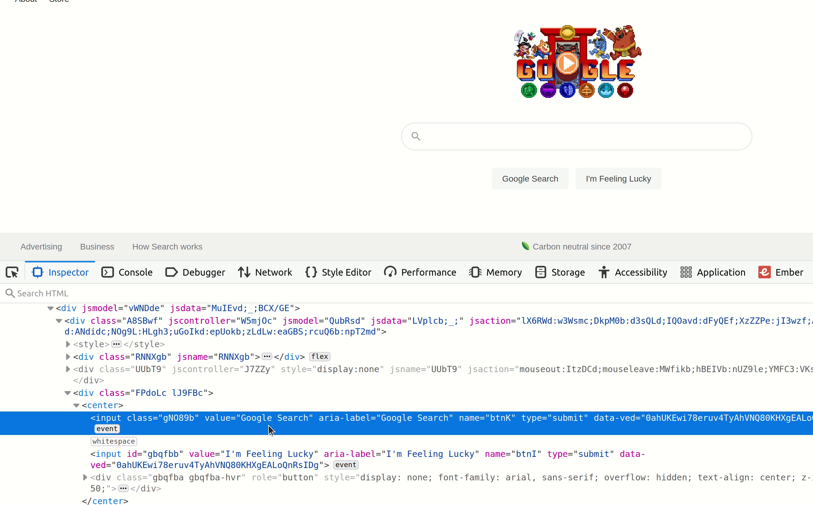

# Dev Tools: Element Inspector & Network Inspector

When you're building a web page, what do you do when something isn't working the way you expect? Open up the browser's developer tools.

<figure>
  
  <figcaption>Dev tools in Firefox</figcaption>
</figure>

<figure>
  
  <figcaption>Dev tools in Chrome</figcaption>
</figure>

Browser dev tools are one of the most useful tools available to web developers, and offer tools for examining web pages, debugging code, watching network traffic, and much more.

## Keyboard shortcut

Dev tools are a minute-by-minute part of the web development process, so it's something you want to be able to open and close quickly. Memorize the keyboard shortcut for opening it, you'll use it often.

* MacOS: `Command` + `Shift` + `i`
* Other Operating Systems: `Control` + `Shift` + `i`

## Element Inspector

One of the most useful items in the dev tools is the element inspector. There are a few different ways it can be used:

* If you right-click on something like text or an image on a web page and select "Inspect Element", it will open the dev tools to the Element Inspector (if it's not open already) and highlight the HTML element it comes from
* This works in reverse as well. If you hover your cursor over an element in the Element Inspector, it will highlight the item on the page it corresponds to
* When the Dev Tools are already open, you can click this icon to select items from the page:

Some things you can do with the element inspector:

* See where (or whether) an element is being rendered
* Temporarily change the content of an element, its tag name, or any of its attributes by double-clicking on the thing you want to change and typing new values. They will all change back when the page is refreshed. 

* See how the browser interpreted the HTML you wrote. What you see in the Element Inspector isn't necessarily what you wrote; If you didn't close tags correctly or otherwise wrote invalid HTML, the browser will make an effort to correct it. The HTML in the Element Inspector represents the browser's interpretation.

## Network Inspector

Another useful tool is the Network Inspector. This tab shows all network requests your browser made for HTML files, stylesheets, scripts, images, and more. This is useful for seeing whether any of those requests succeeded or failed, what the HTTP request looked like, and what the HTTP response looked like.

This can be used to isolate problems to either the browser or the server, as well as examining errors that are sent back from servers.

## Watch Out!

* It's common for browser plug-ins to add elements to the HTML you see in the Element Inspector
* The Network Inspector can get very "noisy" when a page is loading. You can use the filters to only look at the type of request you're interested in. It's easy to forget to reset this when you want to see all requests again!
* There are minor differences between the dev tools available in different browsers and the tools are regularly updated, so some of the terms and images may be different on your computer.

## Additional Resources

| Resource | Description |
| --- | --- |
| [Firefox Dev Tools Reference](https://developer.mozilla.org/en-US/docs/Tools) | The official guide to Firefox dev tools |
| [Chrome Dev Tools Reference](https://developer.chrome.com/docs/devtools/) | The official guide to Chrome dev tools |
| [Free Code Camp: Video guide to Chrome Dev tools](https://www.freecodecamp.org/news/learn-how-to-use-the-chrome-devtools-to-troubleshoot-websites/) | Video tutorial on Chrome dev tools |
