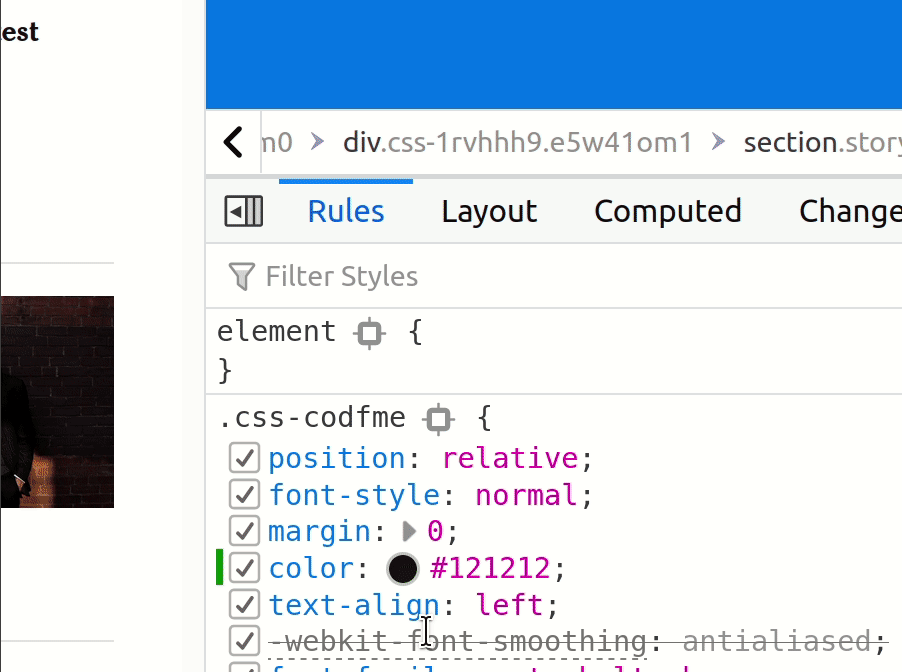
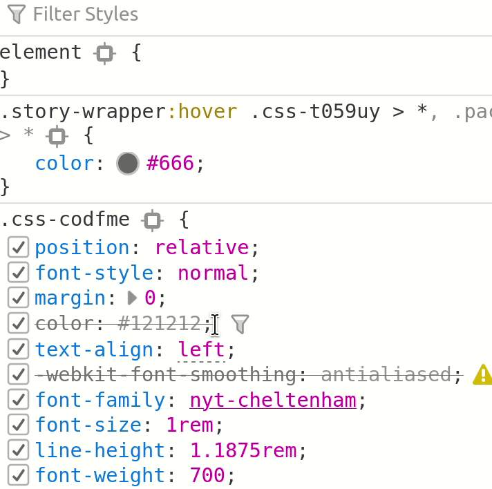

# Dev Tools: Style Editor

After the element inspector and the network inspector, the next most important part of the browser dev tools is the style editor.

## Editing Styles

Styles can be added and edited for any selector, or for specific elements. If you edit a rule for a selector, it will also apply for every other element that uses that same rule:

You can also apply it exclusively to that element:

If you've made an edit you want to permanently apply, you can copy the rule into your stylesheet by highlighting the rule in the dev tools and copy and pasting it into your text editor.

## Style Editor Helpers

When you're editing a numeric value, you can use the up and down arrow keys to adjust them. This is especially useful for visually aligning elements.

When editing a color value, you can use the built-in color picker to change the value.

Each style rule has a checkbox next to it that can be used to turn it on and off.

Each style rule has an autocomplete that shows you all the legal values for a property.

## Style Editor Warnings

Any rules you write that have invalid syntax will be indicated in the style editor:

## Box Model

Another useful part of the style editor is being able to see which box model properties have been set, and what they're currently rendering as:

## Additional Resources

| Resource | Description |
| --- | --- |
| [Firefox Dev Tools Reference](https://developer.mozilla.org/en-US/docs/Tools) | The official guide to Firefox dev tools |
| [Chrome Dev Tools Reference](https://developer.chrome.com/docs/devtools/) | The official guide to Chrome dev tools |
| [Free Code Camp: Video guide to Chrome Dev tools](https://www.freecodecamp.org/news/learn-how-to-use-the-chrome-devtools-to-troubleshoot-websites/) | Video tutorial on Chrome dev tools |
