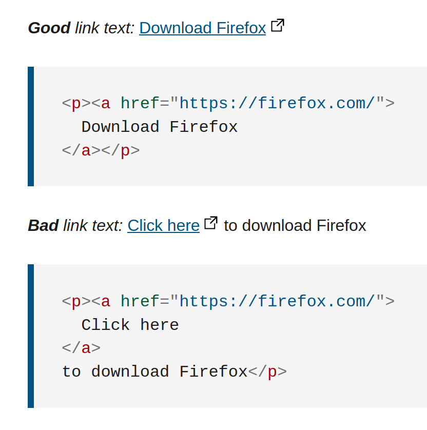

# HTML: Links

One of the core ideas behind the web is that it's a series of interconnected documents. How do these documents actually "interconnect"?

## The Anchor Tag

```html
<a href="filename-to-link-to-goes-here.html">Link text goes here</a>
```

The anchor tag is what links pages together. When you click or tap the text for an anchor tag, your browser requests the HTML file in your `href` attribute.

## Opening Links In a New Tab

You can open a link in a new tab by giving the `target` attribute a value of `_BLANK`:

```html
<a href="https://google.com" target="_BLANK">Click this to open Google Search in a new tab</a>
```

Use this very carefully. This can violate a user's expectations of how the link will work, and doesn't give them the option of opening it in the same tab. It is only appropriate to do this when:

* You're linking to an external site
* You clearly indicate that the link will open in a new tab



## Linking Within A Page

In addition to providing a URL, you can link to a fragment:

```html
<a href="#second-heading">Click this to go to the next line</a>

<h2 id="second-heading">Click the link above will scroll here</h2>
```

This will scroll the screen until the first element with a matching ID is at the top. It does not reload the page. You can also use it to load another HTML file and scroll to a specific ID:

```html
<a href="another-file.html#second-heading">Click this to go to the first element with an ID of "second-heading" in `another-file.html`</a>
```

## Watch Out!

When linking to a URL, note the following conventions:

* `<a href="https://google.com">` - Links to an external site
* `<a href="second-page.html">` - Links to a file called `second-page.html` in the same folder as this HTML file
* `<a href="./second-page.html">` - Links to a file called `second-page.html` in the same folder as this HTML file
* `<a href="pages/second-page.html">` - Links to a file called `second-page.html`, which it will look for in a folder called `pages`, starting in the same folder as this HTML file
* `<a href="/second-page.html">` - Links to a file called `second-page.html` in the folder where the server was started
* `<a href="/pages/second-page.html">` - Links to a file called `second-page.html`, which it will look for in a folder called `pages`, starting in the folder where the server was started

There are several attributes in HTML that take URLs as values, but the attribute names are different.

* `<link>` and `<a>` use `href`
* `<script>` and `` use `src`

It's easy to confuse `<a>` with `<link>`. `<link>` is for attaching external files like stylesheets to the document, not for linking to another page.

## More Resources

| Resource | Description |
| --- | --- |
| [MDN Documentation: `<a>`](https://developer.mozilla.org/en-US/docs/Web/HTML/Element/a) | MDN's documentation of the `<a>` tag |
| [MDN: Creating Hyperlinks](https://developer.mozilla.org/en-US/docs/Learn/HTML/Introduction_to_HTML/Creating_hyperlinks) | MDN's lesson on hyperlinks |
