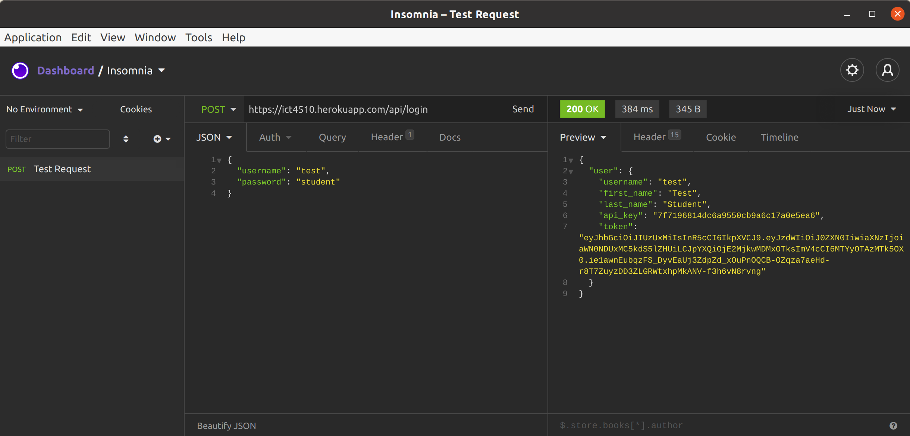

# Debugging APIs With Insomnia

A normal browser can only make `GET` requests to URLs. Futhermore, they can't modify the headers, cookies, body, or any other aspect of the request. The only way to inspect the response of a request is through the dev tools, and everything you see may be subject to interference from browser plugins. This makes browsers a poor tool for inspecting and testing APIs, which need much more flexibility. Insomnia is a tool for crafting detailed HTTP requests and examining the responses, which makes it indispensible for testing APIs.

## Installing Insomnia

[Download and run the installer](https://insomnia.rest/download)

### Making Requests With Insomnia

1. Open Insomnia
2. Press `control`/`command`+`N` or press the `+` icon to start a new request
3. Give the request a label. Note that the method and any other options are modifiable in the interface after you make the request.
3. Design your HTTP request:
  * Method
  * URL
  * Body
  * Authorization tokens
  * Headers
  * Query String
4. Press "Send"
5. Inspect the response. The pane on the right will allow you to view the response body as rendered HTML, raw data, or formatted raw data. Additionally, you can inspect the status code and message, HTTP response headers, and any cookies that would be set by the response.

## Using Insomnia to Debug

A core aspect of debugging is removing as many variables as possible. If you're debugging a full-stack app, your first move should be figuring out whether the problem is happening on the front-end or back-end. A great way to do this is to design a request in Insomnia that you think should generate a particular response. If you're unable to generate the response you're expecting, the problem is likely on the back-end. If you are able to generate the response you're expecting, you need to figure out a way to generate a request on the front-end that matches the one you generated with Insomnia. You can use the browser dev tools to compare URLs, headers, etc. with your Insomnia request.

Note that you can also debug back-ends with Insomnia, verify that particular code paths are being exercised, etc. For more than one-off debugging, you'll benefit more from an API testing library like [SuperTest](https://www.npmjs.com/package/supertest) or a full API spec generator like [Swagger](https://swagger.io/).

## Watch Out!

When sending a JSON body, make sure you're formatting the body as JSON, not a JavaScript object. That means quoted keys, double-quotes for keys and string values, no trailing commas.

## Additional Resources

| Resource | Description |
| --- | --- |
| [Insomnia](https://insomnia.rest/) | Insomnia, a headless browser |
| [Getting Started With Insomnia](https://support.insomnia.rest/article/157-getting-started-with-insomnia) | Official guide to getting started with Insomnia |
