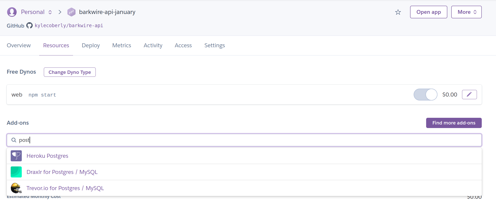

## Heroku: Databases

Deploying an app to Heroku gives you a way to run the server publicly, but you still need a way to host databases. Luckily, Heroku also offers a database service.

## Adding Heroku Postgres

Go to the Heroku app you want to add a database to, then go to "Resources" -> "Add-ons" and search for "Heroku Postgres". Select the appropriate level of support (the default free database offers 10,000 rows and 1GB of space) and click "Submit Order Form." Your database will automatically be associated with your app, and an environment variable called `DATABASE_URL` will be added to your config vars.



## Migrating a Heroku Postgres Database with Knex

To run your production database migrations with Knex, run `heroku -a app-name-goes-here run knex migrate:latest`. You can likewise run `heroku -a app-name-goes-here knex migrate:rollback` to roll back a migration.

You typically don't run seeds on a production database since doing so involves dropping all of your existing data, but if you need to reset a database for demo purposes you can also run `heroku -a app-name-goes-here knex seed:run`.

## Querying a Heroku Postgres Database with Knex

The point of Knex is to abstract out your database logic from your specific database connection, so you shouldn't need to change any of the code in your app. You do need a `production` key in your `knexfile.js` though:

```js
module.exports = {
  development: {
    client: "pg",
    connection: "postgres:///some-local-database",
  },
  production: {
    client: "pg",
    connection: process.env.DATABASE_URL,
  }
}
```

As long as your database connection is using `process.env.NODE_ENV` to determine the environment, it will connect to the Heroku Postgres database in production. This is because Heroku sets the `NODE_ENV` environment variable to "production" by default.

```js
// database-connection.js
const config = require("./knexfile")[process.env.NODE_ENV || "development"]
module.exports = require("knex")(config)
```

## Watch Out!

* Running migrations requires [Heroku CLI](https://devcenter.heroku.com/articles/heroku-cli#download-and-install) to be installed and for `heroku login` to have been run.
* If your database works locally but not on Heroku, try logging the `config` variable in your `database-connection.js` file or equivalent to make sure that Heroku is trying to load the right Knex configuration.

## Additional Resources

| Resource | Description |
| --- | --- |
| [Prisma: How to set up a free PostgreSQL database on Heroku](https://dev.to/prisma/how-to-setup-a-free-postgresql-database-on-heroku-1dc1) | Blog post on how to set up a Heroku Postgres database |
| [Heroku: Heroku Postgres Docs](https://devcenter.heroku.com/articles/heroku-postgresql) | Heroku's official docs on Heroku Posgres |
| [Knex: Client Configuration](https://knexjs.org/#Installation-client) | Knex's official docs on configuring clients |
| [Video: Setting up a Postgres database in Heroku](https://www.youtube.com/watch?v=OZQWfW3VvhE) | Video tutorial on Heroku Postgres deployment |
