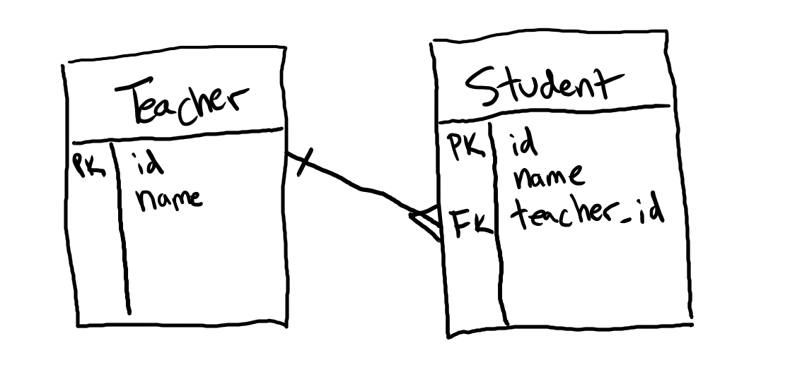

# Knex: Relations

You can create and modify database tables with Knex. How do you create relationships between tables?

## References

The most common way to create relationships between tables in a Knex migration is using a reference:

```js
module.exports.up = knex => {
  return knex.schema.createTable("student", table => {
    table.increments()
    table.string("name")
    table.integer("teacher_id").references("id").inTable("teacher")
  })
}
```

This example says that the `student` table will have a column called `teacher_id`, which is a foreign key to the `id` column in the `teacher` table.



## Cascading

What should happen to a teacher's students if you delete the teacher from the database? There are three common scenarios:

* **The students should be deleted too**. This is common when one entity has a exclusive ownership relationship with another. In this case, the foreign key should be written as `table.integer("teacher_id").references("id").inTable("teacher").onDelete("CASCADE")`
* **The students should have no teacher until they're reassigned**. This is common when one entity has a temporary ownership relationship with another. In this case, the foreign key should be written as `table.integer("teacher_id").references("id").inTable("teacher").onDelete("SET NULL")`
* **The teacher should be prevented from being deleted if they still have students**. This is common when you want to enforce rules, such as never deleting a student but also ensuring that every student always has a teacher. In this case, the foreign key should be written as `table.integer("teacher_id").references("id").inTable("teacher").onDelete("RESTRICT")`

## Watch Out!

A table needs to exist already before you make references to it. More broadly, this means that generally you need to create tables that aren't used as references before you create tables that are used as references.

## Additional Resources

| Resource | Description |
| --- | --- |
| [Knex: `.references`](https://knexjs.org/#Schema-references) | Official Knex docs on `.references` |
| [Knex: `.inTable`](https://knexjs.org/#Schema-inTable) | Official Knex docs on `.inTable` |
| [Knex: `.foreign`](https://knexjs.org/#Schema-foreign) | Official Knex docs on `.foreign` |
