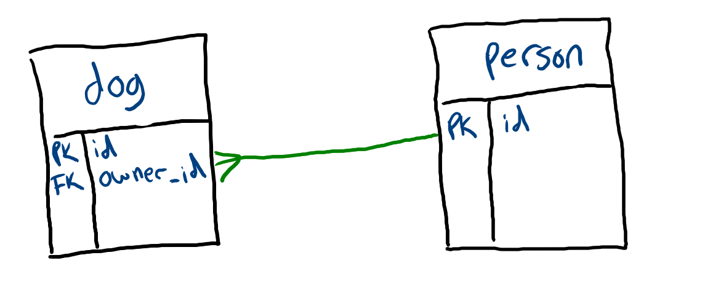

# Objection: One-to-Many

Building models with Objection is elegant and has some benefits, but you really see its power when you start working with related data.

## Modeling One-to-Many Relationships



To model relationships with Objection, use the `relationMappings` static getter on a model:

```js
class Dog extends Model {
  static tableName = "dog"

  static get relationMappings(){
    return {
      owner: {
        relation: Model.BelongsToOneRelation,
        modelClass: require("./Person"),
        join: {
          from: "dog.owner_id",
          to: "person.id"
        },
      },
    }
  }
}
```

```js
class Person extends Model {
  static tableName = "person"

  static get relationMappings(){
    return {
      dogs: {
        relation: Model.HasManyRelation,
        modelClass: require("./Dog"),
        join: {
          from: "person.id",
          to: "dog.owner_id",
        },
      },
    }
  }
}
```

[Play with this code](https://codesandbox.io/s/gifted-tree-2jm56)

Some things to note:

* Each key in the object returned from the `relationMappings` getter is what you want to name a relationship. In general, you should use the plural of the model if it's a `hasManyRelation` and the singular of the model if it's a `BelongsToOneRelation`, but you can name them anything you wish.
* The `Model` object has specific classes that define the type of relationship. The two relevant to 1:M relationships are:
  * `Model.HasManyRelation`, which should be used to reference the _many_ side of a relationship
  * `Model.BelongsToOneRelation`, which should be used to reference the _one_ side of a relationship
* The `modelClass` property needs to reference the actual class of the model you're creating a relationship with, not just the name of it. The safest way to do this is by putting it in an external file and requiring directly into the property.
* Putting the `require` statement in the `modelClass` itself helps resolve situations where two models depend on each other.
* The `join` object describes which columns should match in the database, meaning one should be a primary key and the other a foreign key. `from` should always be the table of the model you're writing the relationship on. Both values are strings describing the table and the column in the database.

## Reading Related Records

To read related records, use the `.withGraphFetched` method of a model:

```js
const peopleWithDogs = Person.query().withGraphFetched("dogs")

/*
[{
  id: 1,
  name: "Kyle",
  dogs: [{
    id: 1,
    name: "Bixby",
  }]
},{
  id: 2,
  name: "Elyse",
  dogs: [{
    id: 1,
    name: "Mesa",
  },{
    id: 2,
    name: "Harmony",
  }]
}]
*/
```

You can also use combine it with the query methods you already know:

```js
const personWithDogs = Person.query().findById(2).withGraphFetched("dogs")

/*
[{
  id: 2,
  name: "Elyse",
  dogs: [{
    id: 1,
    name: "Mesa",
  },{
    id: 2,
    name: "Harmony",
  }]
}]
*/
```

## Inserting Related Records

To insert several related records, use `.insertGraph`:

```js
Person.query().insertGraph([{
  name: "Kyle",
  dogs: [{
    name: "Bixby",
  }]
},{
  name: "Elyse",
  dogs: [{
    name: "Mesa",
  },{
    name: "Harmony",
  }]
}])
```

This inserts 2 people and 3 dogs into the database and correctly associates the records.

## Watch Out!

`HasManyRelation` and `BelongsToOneRelation` are classes (not properties or methods) so they start with capital letters

## Additional Resources

| Resource | Description |
| --- | --- |
| [Objection: Relations](https://vincit.github.io/objection.js/guide/relations.html#examples) | Official Objection docs on relations |
