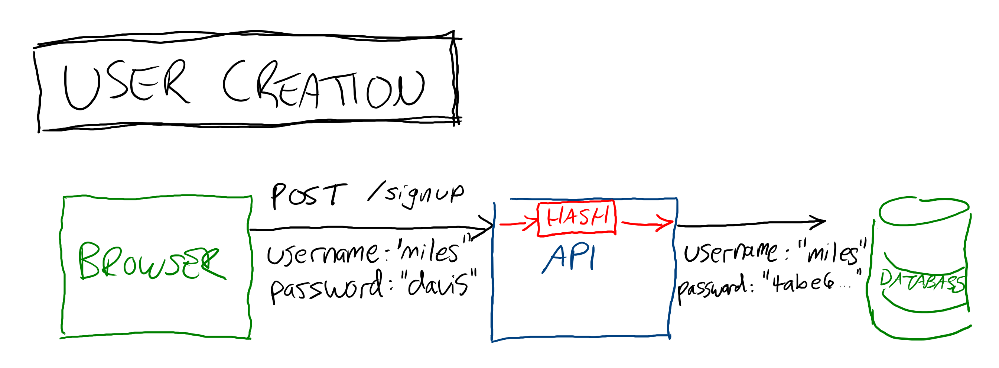
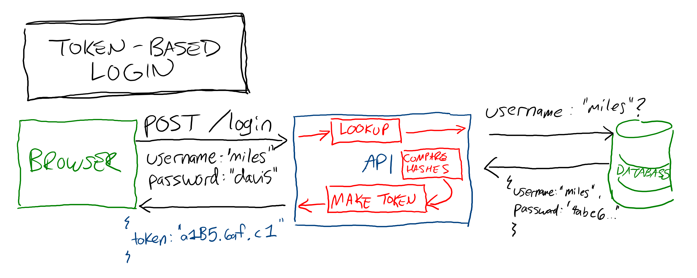
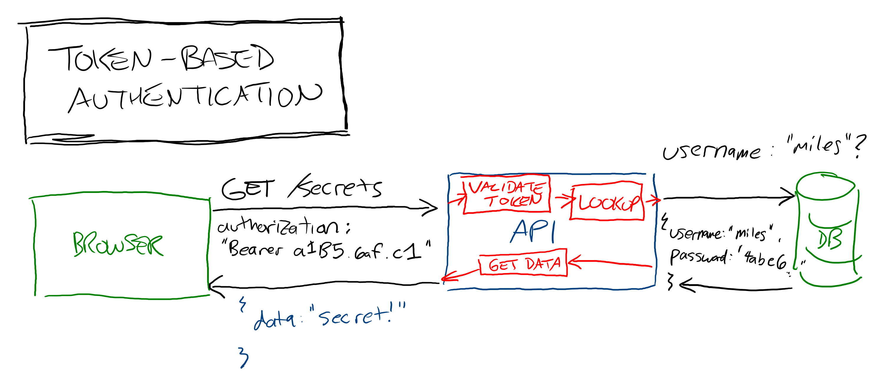

# Intro to Auth

Some applications aren't personal. For example, a calculator doesn't need any concept of identity because everyone uses it in the same way, and many casual games don't need to persist user progress. However, most applications need to manage identities. For example:

* Social media apps need to differentiate one user's posts, comments, and network from another
* eCommerce apps need to save payment credentials and wishlists for different users
* Messaging apps need to control which users can see and send which messages

How do you integrate identity systems into your applications?

## Authentication vs. Authorization

Auth refers to two concepts: Authentication and authorization. Authentication is verifying that someone is who they claim to be, usually by validating credentials or tokens they send. Authorization is verifying that someone has permission to do whatever they're attempting to do. For example, if someone claims to be Christina Aguilera, the process of checking whether or not that's true is authentication. Authorization is figuring out whether or not Christina is allowed to enter a particular building.

## Token-Based Authentication

There are several different patterns in API authentication, but one of the simplest and most versatile is token-based authentication. There are 3 parts to token-based authentication:

* Creating an account
* Logging in to get a token
* Use the token to access a secured resource

### Account Creation

Creating an account is similar to creating anything else in a database. The only difference is that passwords must be obfuscated through a process called hashing before they're stored.

### Logging In

Once a user has an account, they resubmit their credentials anytime they need to prove their identity. The password they submit is hashed and compared to the stored hashed password. If they match, the user is given a token that can be sent as a proof of their identity with future requests.

#### Access Secured Resources

When users want to access a secured resource they send their token along with their request. The server verifies the token is valid and hasn't been tampered with, and it can use the data inside the token to look up the user's database record. The server can now check whether that user is authorized to perform the requested action and proceed accordingly.

### Token-Based Authentication Considerations

Token-based authentication advantages:

* Token-based authentication is stateless, meaning that the server doesn't need to maintain any record of who is logged in. This is architecturally simpler and easier to scale than auth strategies that rely on keeping login records in a database.
* Tokens work on any device, including non-browser-based devices like native phone apps or hardware.

Token-based authentication disadvantages:

* If a user's token is compromised, there's no way to differentiate between the real user and an imposter who happens to have their token.
* There's no way to log out a user from the server, you just have to wait for their token to expire. This may be a security consideration in situations where users can have their access suddenly change, such as an employee being fired.

## Watch Out!

Auth is a complicated concept with more security implications than anything else in application development. Additionally, current best practices may have vulnerabilities that haven't been discovered yet. Exercise extreme caution in building auth systems for production apps with real users as you may be legally liable for security breaches caused by your code. The only way to learn auth is to practice. Until you're confident you're ready to take responsibility for your security choices, ask for a review from a developer with experience in auth systems before launching production auth code.

## Additional Resources

| Resource | Description |
| --- | --- |
| [Wikipedia: Authentication](https://en.wikipedia.org/wiki/Authentication) | Wikipedia's article on the concept of authentication |
| [Wikipedia: Authorization](https://en.wikipedia.org/wiki/Authorization) | Wikipedia's article on the concept of authorization |
| [Auth0: Authentication and Authorization](https://auth0.com/docs/get-started/authentication-and-authorization) | Auth0's article comparing authentication and authorization |
| [Okta: What is token-based authentication?](https://www.okta.com/identity-101/what-is-token-based-authentication/) | Okta's article explaining token-based authentication |
| [Video: JWT Authentication tutorial](https://www.youtube.com/watch?v=mbsmsi7l3r4) | Web Dev Simplified's tutorial on Node auth with JWTs |
