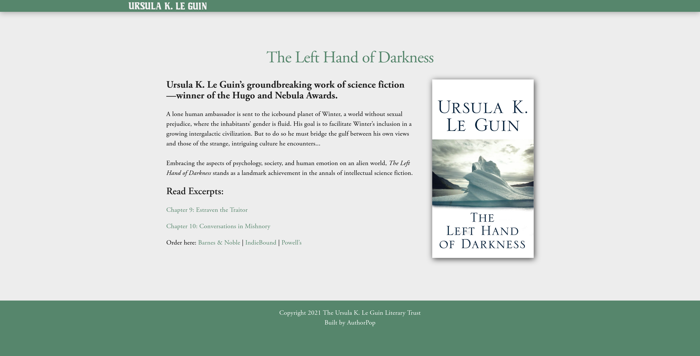

# Book Promo Page

Make a one-page promotional site for a book you like.

It should feature:

* An image of the book cover
* Information about the author
* A summary of the book
* Quotes from reviews about the book
* A link to purchase the book
* An excerpt from the book

It should be:

* Semantically marked up
* Appropriately styled
* Deployed

Examples:

* [Data Detective](https://timharford.com/books/datadetective/)
* [Digital Minimalism](https://www.calnewport.com/books/digital-minimalism/)
* [Raised In Captivity](https://www.chuckklostermanauthor.com/books/raised-in-captivity-hc)
