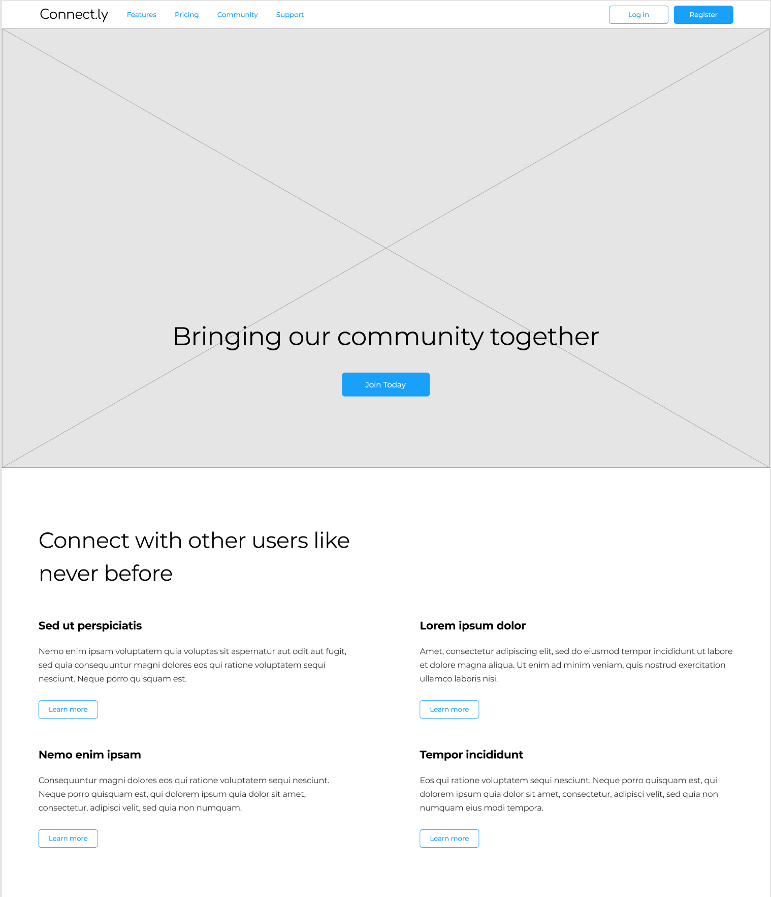

# Connect.ly

Connect.ly is a new social media platform for the brand you've been given. Use the follow content to implement your design.

## Brand Name

Connect.ly

Create a simple wordmark logo for Connect.ly using a display font.

## Navigation

* Features - Goes to /features.html
* Pricing - Goes to /pricing.html
* Community - Goes to /community.html
* Support - Goes to /support.html
* Login - Goes to /login.html
* Register - Goes to /register.html

## Hero

Tagline: "Bringing our community together"
Call to action: "Join Today"

Background image: community.webp

## Features and Benefits

"Connect with other users like never before"

---

Feature: "Chat in real-time"
Benefit: "With Connect.ly's new chat system, reaching out to other users has never been easier. Find new people to connect with, and stay in touch with your besties."
Action: "Learn more"

---

Feature: "Organize events"
Benefit: "Finding the right time and place to get everyone together was tricky before Connect.ly. Now, you can use a simple grid-based view to find out what works best for everyone."
Action: "Learn more"

---

Feature: "Play favorites"
Benefit: "Let's face it, everyone has favorites. With Connect.ly, now you can not only track your favorite products, but share them with the rest of your network too."
Action: "Learn more"

---

Feature: "Earn Kred"
Benefit: "When you engage with our community, you should be rewarded. That's why Connect.ly tracks the Kred you've already accumulated and gives you even more ways to earn Kred."
Action: "Learn more"
