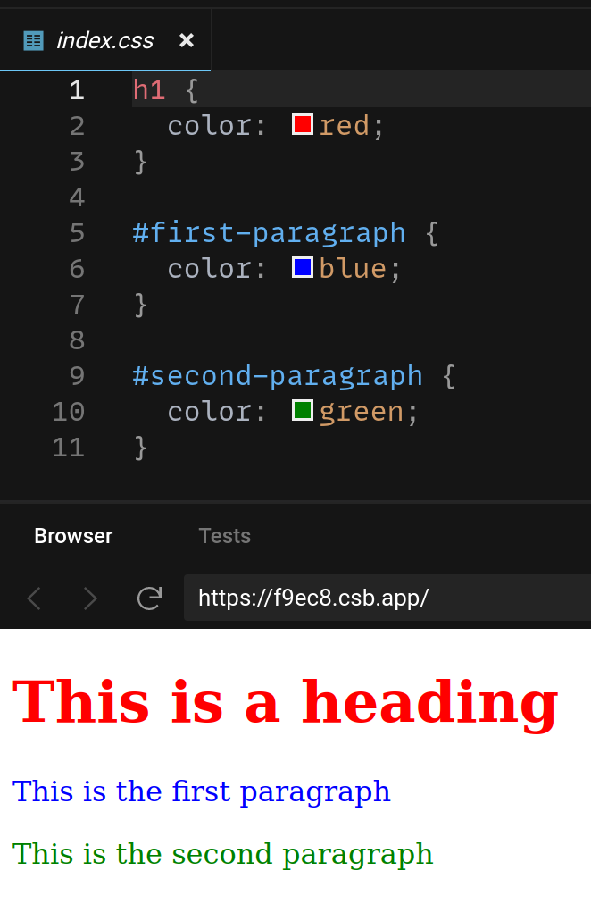

# Basic CSS

CSS is how you decorate content.

## CSS Selectors

To style an HTML element, you need to write code that "selects" it.

```html
<h1>This is a heading</h1>
<p id="first-paragraph">This is the first paragraph</p>
<p id="second-paragraph">This is the second paragraph</p>
```



[Play with this code](https://codesandbox.io/s/sweet-panini-f9ec8?file=/index.css)

You can either select all elements with the same tag, or you can select an element by it's ID by putting a `#` in front of the ID.

## CSS Declarations

Once you've selected elements, you can declare what you'd like them to look like.


[Play with this code](https://codesandbox.io/s/spring-water-38zf5?file=/index.css)

CSS declarations have a property (on the left) and a value (on the right). They're separated with a `:` and end with a `;`.

Some common CSS properties:

### Typography

* `font-family: Arial, sans-serif;` - Sets the type of the font
* `font-weight: bold;` - Sets the weight of the font (eg. bold)
* `font-size: 32px;` - Sets the size of the font
* `color: grey;` - Sets the color of the font

### Layout

* `display: block;` - Makes the element take up an entire line
* `display: inline;` - Makes the element take up as little space as possible
* `max-width: 200px;` - Sets the widest an element can get
* `padding: 16px;` - Sets how much space around an element there is
* `background-color: red;` - Sets a background color for the element

## Watch Out!

You get some styles from the browser for free. For example, text in an `<h1>` tag is usually bold and large. You can keep these defaults, or override them with your own CSS.
