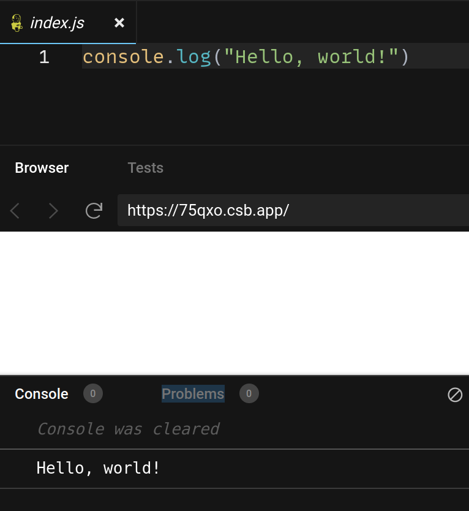
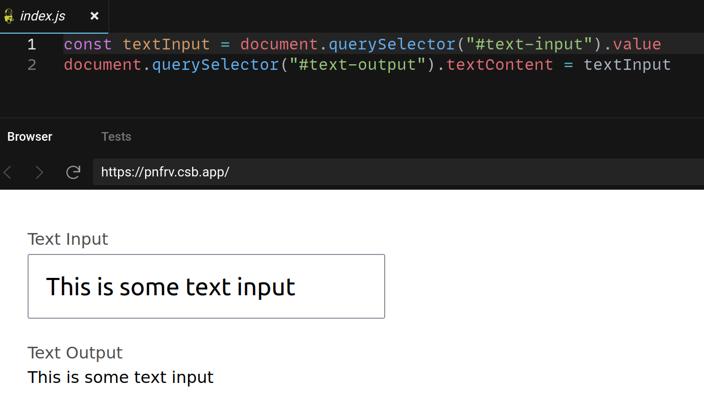
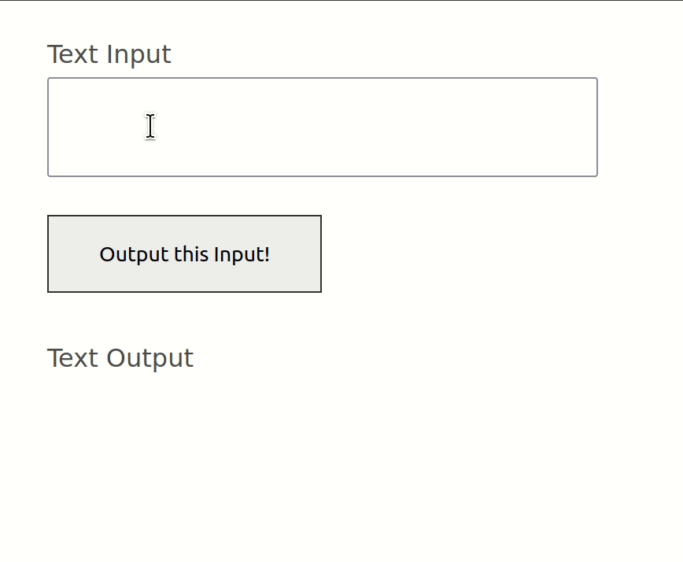

# Basic JS

JavaScript is a language for adding actions to web pages. For example, when we click the button in our MadLibs app, we want to read all the values out of the inputs and add them back to the page.

## Logging

One of the easiest ways to examine the code you write in JavaScript is to log it.

_

[Play with this code](https://codesandbox.io/s/musing-snow-75qxo?file=/index.js)

When you use `console.log()`, anything between the parentheses will be printed to the console. The console isn't the same thing as the "screen"- you have to specifically open it up. It's useful for testing your code and examining what different things do.

To open up the console in a browser:

* Mac: ⌘ + ⇧ + `j`
* Windows: `Control` + ⇧ + `j`

## JavaScript Variables

JavaScript variables are containers that keep values.

```js
const firstName = "Carlos"
console.log(firstName) // Prints "Carlos"
```

We can declare variables with `const`, give the variable a name, and then set it equal to a value.

When a variable is multiple words, it's conventional to lowercase all of the first word and use uppercase for the first letter the other words. This is called "camelCase".

## DOM Methods

DOM methods are a way to read and write things to web pages.

```html
<label for="text-input">Text Input</label>
<input id="text-input" value="This is some text input" />

<label for="text-output">Text Output</label>
<output id="text-output"><output>
```



[Play with this code](https://codesandbox.io/s/brave-stallman-pnfrv?file=/index.js)

## JavaScript Functions

Functions are a way to group a bunch of things in JavaScript.

```js
// This says what the function does
function substituteWords(){
  const textInput = document.querySelector("#text-input").value
  document.querySelector("#text-output").textContent = textInput
}

// This actually executes it
substituteWords()
```

One of the ways functions help us is that we execute them in response to a user action, like a click. For example, if your HTML has a `<button>`:

```html
<label for="text-input">Text Input</label>
<input id="text-input" />
<button id="transform">Output this Input!</button>

<label for="text-output">Text Output</label>
<output id="text-output"><output>
```

You can get the button with a DOM method and give it a function to execute when its clicked:

```js
function substituteWords(){
  const textInput = document.querySelector("#text-input").value
  document.querySelector("#text-output").textContent = textInput
}

const button = document.querySelector("#transform")
button.onclick = substituteWords // No parentheses!
```



[Play with this code](https://codesandbox.io/s/friendly-mccarthy-hg0h8?file=/index.js)
