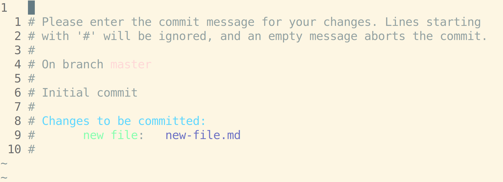

# Git: Commits

Git commits represent a specific save point in the history of your code. How do you make them?

## Unit of Work

Commits should represent a single unit of work. This term is open to a wide degree of interpretation, but these are some examples of single units of work:

* Fixing something that was broken
* Creating a new feature
* Removing a feature
* Reorganizing working code in a file
* Reorganizing files and folders in a repo

These usually don't represent single units of work:

* Multiple features
* Work in progress for multiple features
* Changing something from being broken in one way to being broken in a different way
* Adding a single line of code
* Changing the name of a variable
* Creating an empty file or folder

That said, you're better off making too many commits than too few. There are variety of advanced techniques for reorganizing and combining previous commits that you've made if you end up with more commits than necessary.

## Staging Strategy

It's important to make your commits represent a single unit of work because that's what allows you to locate and undo those changes later. If all of the changes you've made represent a single unit of work, you can stage them all at once with `git add -A`. If you've made changes that represent more than one unit of work, you can break them up into multiple commits by staging then commiting the files and hunks for each unit of work sequentially.

## `git commit`

Once you've staged files you want to commit, run `git commit -m "Enter a message describing the single unit of work here"`. Note that the `-m` stands for "message", and it's a note that will be attached to the commit so you can remember what work was done in it.

## Commit Messages

Commit messages should be written in "present imperative." That means it's written as a command in the present tense:

* `Fix the bug`
* `Add the feature`
* `Remove the duplication`

This can feel a little awkward because it would usually be considered rude to say to someone. A commit message is not a description of what **you** did, it's a description of what you're ordering the computer to do. This convention helps stay consistent with Git itself. Here's a partial list of present imperative verbs you can use to start commit messages:

* Add
* Drop
* Fix
* Make
* Start
* Stop
* Optimize
* Document
* Refactor
* Reformat
* Rearrange
* Reword

## Watch Out!

* By default, your terminal will open a text editor called Vim if you enter `git commit` without any other arguments. It looks like this:

Vim is a modal text editor, which means that each key on the keyboard does more than just type characters. For now, learn how to exit out of it:

1. Press `ESC` 3 times
2. Type `ZQ`. Note the capitals- that is `Shift` + `z`, followed by `Shift` + `q`. This quits without saving.

## Additional Resources

| Resource | Description |
| --- | --- |
| [Git: Commit](https://git-scm.com/docs/git-commit) | Git's official reference on commiting |
| [Atlassian: Git Commit](https://www.atlassian.com/git/tutorials/saving-changes/git-commit) | Atlassian's guide to Git commits |
