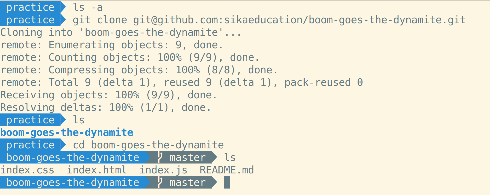

# Git: Remotes

One of the most powerful aspects of Git is that everyone who has a copy of a repo not only has all of the files in the repo, but they all individually have a copy of all of the previous states of the repo. That means if one person's copy of a repo becomes lost or corrupted, they can easily get a new one from anyone else who has a copy and not lose any work or history. This makes Git repos incredibly resilient to corruption or loss. Services like GitHub, Bitbucket, and GitLab are primarily tools for a storing a copy of a repo that other developers can make their own copy of (or "clone"), including the repo's entire history.

## Cloning

The most common way to get a copy of a repo is to clone it from a service like GitHub:

```bash
git@github.com:githubtraining/example-basic.git
```

This will copy the repo from GitHub's computers to your computer, into a folder called `example-basic` in your current directory.

Cloning a repository from a remote repo usually means authenticating somehow. If you clone a repo using GitHub's "SSH" option:


It will look for an SSH key in your `~/.ssh` directory to send with your clone request. If that key is connected to your GitHub account, GitHub will check to see if your account has permission to clone that repo. If it does, it will be copied to your computer.

Alternatively, if you clone a repo using GitHub's "HTTPS" option:



It will ask you to enter your GitHub username and password.

The SSH option makes working with GitHub much easier, but requires generating an SSH key and connecting it to your GitHub account. Follow these [instructions to connect with SSH](https://docs.github.com/en/github/authenticating-to-github/connecting-to-github-with-ssh) if you haven't already.

## Adding a Remote

Instead of cloning a repo, you can make one locally with `git init` and push it to a service like GitHub:

```bash
git remote add origin git@github.com:githubtraining/example-basic.git
```

This enables you to "push" your copy of the Git repo to GitHub and "pull" GitHub's copy of the repo to your computer to get the latest changes.

If you make a mistake (such as adding the browser URL instead of the `.git` URL), you can fix it with `set-url`:

```
git remote set-url origin git@github.com:githubtraining/example-basic.git
```

## Pushing

When you make new commits in your local repo, you can use `git push` to make a Git remote add your new commits to its copy of the repo:

```bash
git push origin master
Everything up-to-date

git add new-file-to-stage.md
git commit -m "Make a new commit"

git push origin master
[master 5de05dd] Make a new commit
 1 file changed, 6 insertions(+)
```

## Pulling

When someone else makes new commits and pushes them to a Git remote, you can sync the new commits to your local repo with `git pull`:

```bash
git pull origin master
Already up to date.
Current branch master is up to date.

# Someone else pushes a new change to GitHub:

git pull origin master
emote: Enumerating objects: 97, done.
remote: Counting objects: 100% (94/94), done.
remote: Compressing objects: 100% (89/89), done.
remote: Total 89 (delta 68), reused 0 (delta 0), pack-reused 0
Unpacking objects: 100% (89/89), 44.67 KiB | 109.00 KiB/s, done.
From github.com:github-user/repo-name
```

## Pull Before Push

If the Git remote has commits that you don't have yet, you will need to `git pull origin master` before you can `git push origin master`. This is because if there are any problems syncing the two repos, you will need to resolve them on your computer before pushing remotely.
