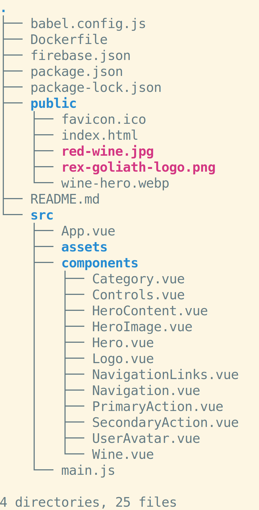

# CLI: File Management: Exercises

## Questions

* In a UNIX file system, what does it mean when a file starts with a `.`?
* In a UNIX file system, what does it mean when a file ends with `.xpi`?
* How do you create new empty files on the CLI?
* How do you create new empty directories on the CLI? 
* Why is the command to to create new files called `touch`?
* What command displays the contents of a file on the CLI?
* How do you rename a file on the CLI?
* What command moves a file on the CLI?
* Explain why the same command moves and renames files.
* How do you copy a file on the CLI?
* How do you copy a directory on the CLI?
* What is the command to delete a file on the CLI?
* What is the command to delete an empty directory on the CLI?
* What is the command to delete a directory with files in it on the CLI?

## Activities

Given the following directory structure:

As well as knowing that the folder is in a directory called `/users/admin/projects/wineflix`:

* What is the absolute path to the `Category.vue` file?
* If you're in the `public` directory, what command would move you to the `components` directory?
* If you're in the `src` directory`, what would the output be if you ran `pwd`?
* If you ran `ls` in the root of the project folder, what would the output be?
* If you're in the `components` directory, what directory will you be in if you run `cd ../..`?
* If you're in the `src` directory, what directory will you be in if you run `cd ../../..`?

---

Given the following directory structure:

As well as knowing that the folder is in a directory called `/users/admin/projects/wineflix`:

* If you're in the `src` directory, how would you create a file called `Wines.vue` in the `components` folder in one command?
* If you're in the `components` directory, how would rename `Hero.vue` to `Header.vue` in one command?
* If you in the `src` directory, how would you rename `assets` to `media` in one command?
* If you're in the `src` directory, how would you delete the `Category.vue` file in one command?
* If you're in the `src` directory, how would you delete the `assets` directory in one command?
* If you're in the `public` directory, how would you delete the `components` directory in one command?
* If you're in the `components` directory, how would you copy the `Wine.vue` file to a new file in the same directory called `Wines.vue`?
* If you're in the `src` directory, how would you copy the `Wine.vue` file to a new file in the same directory called `Drink.vue`?
* If you're in the project root directory, how would you copy the `red-wine.jpg` file to the `assets` directory?
