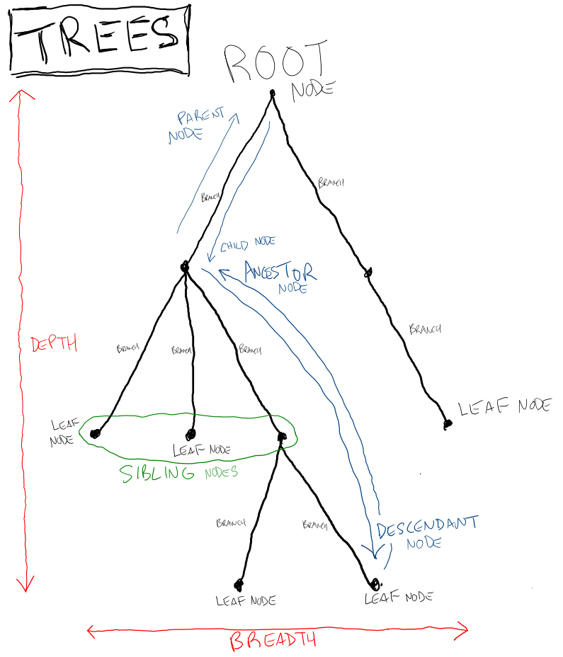
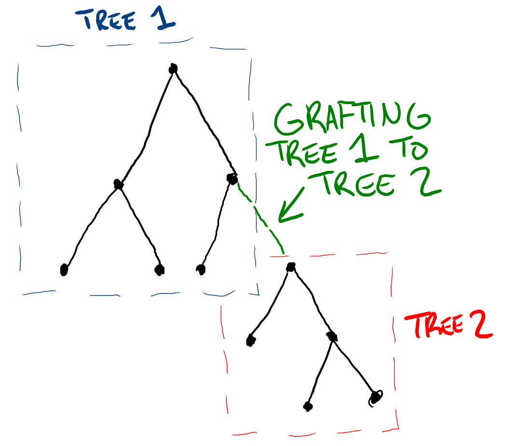
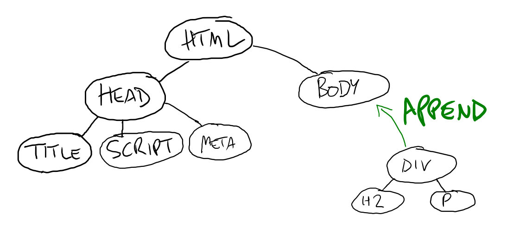
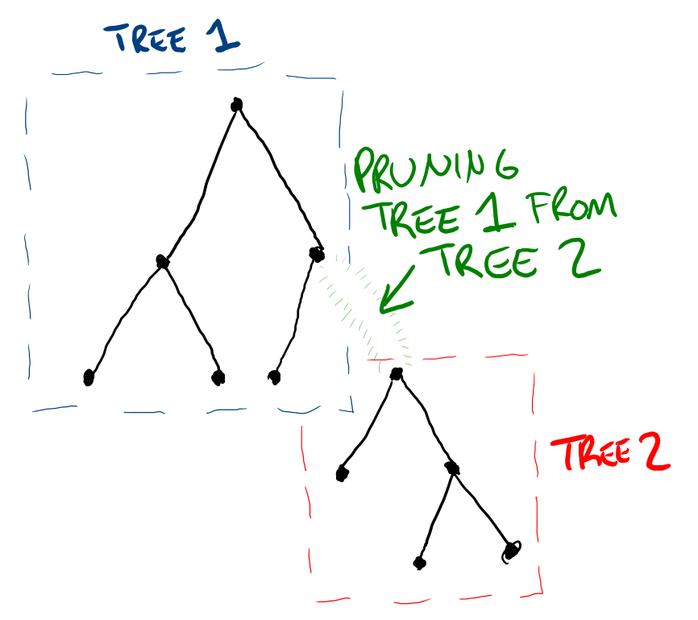
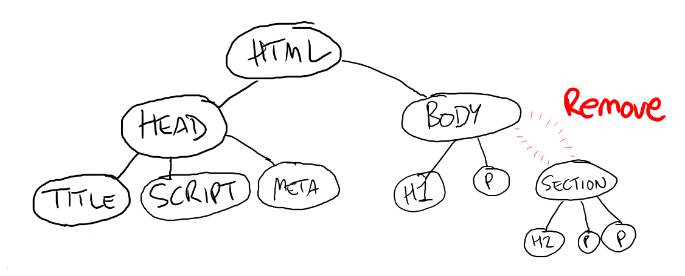

# Data Structures: Trees

One of the more common and useful data structures to learn is trees.

## Anatomy of a Tree



* **Node**: An item in the tree
  * **Root Node**: A node with no parents
  * **Leaf Node**: A node with no children
  * **Parent Node**: A node with children
  * **Child Node**: A node with parents
  * **Ancestor Node**: A node that can be accessed through parents
  * **Descendant Node**: A node that can be accessed through children
  * **Sibling Node**: A node with the same parent
* **Branch**: Path connecting two nodes
* **Depth**: How many levels of children the tree has
* **Breadth**: How many leaves the tree has

## Basic Concepts

### Nodes

Any node is generally aware of its parents and its children, but nothing else in the tree. That means if a node wants to look for another node in the tree, it needs to "walk" the tree one parent or child at a time.

(walking the tree diagram)

A practical example of this is the DOM. Any DOM node knows its parent, and it knows its children. It can repeatedly look up parents and children to do things like event bubbling and applying styles. It can also communicate with siblings and other subtrees by going up the tree and then back down. This idea is a critical part of understanding component frameworks like React.

### Grafting



Any part of the tree is also technically a tree itself. This is why we can make several connected DOM nodes at the same time and then append them all at once ("grafting").

```js
const div = document.createElement("div")
div.innerHTML = `
  <h2>Heading</h2>
  <p>Paragraph</p>
`
const body = document.querySelector("body")
body.append(div) // Grafting the tree in `div` to the tree in `body`
```



### Pruning



```js
const section = document.querySelector("section")
section.remove()
```



## Examples

* Site index
* Computer directory structure
* Evolutionary tree
* Family tree
* Management hierarchy
* Dewey decimal system
* Online shopping categories
* Phrase structure trees in linguistics
* Playoff brackets
