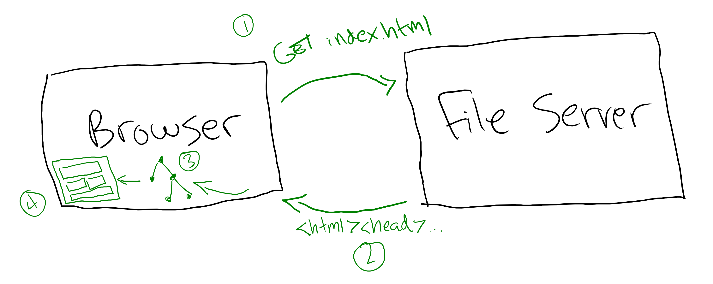

# DOM

How do you combine HTML and JavaScript to make your web pages dynamic and interactive?

## The Document Object Model

The Document Object Model, or DOM, is what enables you to manipulate web pages with JavaScript. The web pages you write in HTML go through a few steps before they're rendered on the screen:

1. The browser requests an HTML file from a file server
2. The file server gives the browser the HTML file
3. The browser steps through each element in the HTML file and turns them into a tree of DOM nodes
4. The DOM nodes are rendered to the screen



So when you write this HTML:

```html
<body>
  <header>
    <h1>Site Title</h1>
    <nav>
      <ul>
        <li>
          <a href="news.html">News</a>
        </li>
        <li>
          <a href="about.html">About</a>
        </li>
      </ul>
    </nav>
  </header>
  <main>
    <h2>A Heading</h2>
    <p>Some content, including <a href="page-2.html">links.</a></p>
  </main>
</body>
```

Your browser will create this DOM tree:


The browser offers JavaScript a variety of methods for reading, writing, and otherwise interacting with this tree.

## Watch Out!

Once your browser ingests HTML and builds out the DOM, it's not HTML anymore. Even when you look at HTML in the element inspector, that's your browser recreating HTML based on the current state of the DOM. You can think of HTML as a set of instructions for how to build the DOM.
