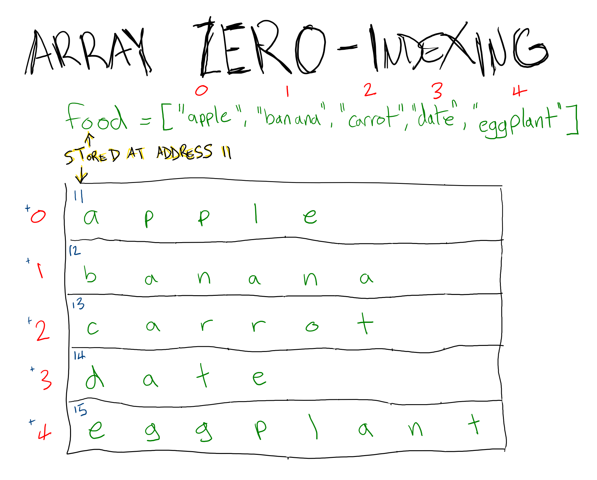

# JavaScript: Arrays

You have a shopping list:

```js
const item1 = "Apple"
const item2 = "Banana"
const item3 = "Carrot"
```

How could you tell that you have 3 items on the list? How would get the second item? How would you perform some operation on every item in the list?

```js
const shoppingList = [
  "Apple",
  "Banana",
  "Carrot",
]

console.log(
  shoppingList.length, // 3, the number of items on the list
  shoppingList[1], // "Banana", the second item on the list
  shoppingList.forEach(console.log), // Prints each item
)
```

Arrays store collections of related items.

## Indexing

To get an individual item in an array, access its index:

```js
const shoppingList = [
  "Apple",
  "Banana",
  "Carrot",
]
console.log(
  shoppingList[0], // "Apple"
  shoppingList[1], // "Banana"
  shoppingList[2], // "Carrot"
)
```

Trying to access an index that doesn't exist (like `shoppingList[3]`) will throw an error.

Indexes are zero-based, meaning that the first item has an index of 0, the second item has an index of 1, and so on.

## Methods, Properties, and Operations

### Adding and Removing Elements

To add an element to an array:

* Use `.push` to add an element to the end of an array
* Use `.unshift` to add an element to the beginning of an array

To remove an element from an array:

* Use `.pop` to remove an element from the end of an array
* Use `.shift` to remove an element from the beginning of an array

For example:

```js
const shoppingList = [
  "Banana",
  "Carrot",
]

shoppingList.push("Dates") // Adds to the end
const thisWillBeDates = shoppingList.pop() // Removes "Dates" from `shoppingList`
shoppingList.unshift("Apple") // Adds to the beginning
const thisWillBeApples = shoppingList.shift() // Removes "Apple" from `shoppingList`
```

## Getting Part of a String

To get part of an array, use the `.slice` method:

```js
const array = ["A", "B", "C", "D", "E", "F", "G"]
const substring = string.slice(2, 4) // ["C", "D", "E"]
```

`.slice` takes a starting index and an ending index. Note that both of these are zero-based.

### Spreading

`.push`, `.pop`, `.shift`, and `.unshift` each change the original array. An alternative way to add elements that preserves the original array is using the spread operator, `...`. Consider:

```js
const someArray = [1, 2, 3]
someArray.push(4)
const anotherArray = [...someArray, 5]
const yetAnotherArray = [0, ...someArray]
console.log(someArray) // [1, 2, 3, 4]
console.log(anotherArray) // [1, 2, 3, 4, 5]
console.log(yetAnotherArray) // [0, 1, 2, 3, 4, 5]
```

### `.length`

`.length` returns how many items are in the array. This is _not_ zero-based, so an array with 1 item in it will have a `.length` of 1. This can create some confusion when iterating, because the number of items will always be 1 more than the last valid index.

## Terminology

* Array: A collection of elements
* Elements: Each item in an array
* Index: A number representing the location of an individual element
* Push: Add an element to the end of an array
* Shift: Add an element to the front of an array
* Pop: Remove an element from the end of an array
* Unshift: Remove an element from the front of an array

## Watch Out!

* When you store an array in a variable, its name should be plural. An array of `person` is `people`, an array of `user` is `users`, an array of `number` is `numbers`. If the element is uncountable (like `pokemon`), consider distinguishing it with a modifier like `pokemonList`.
* Array indexes start at 0, not 1.
* When iterating through an array, make sure you don't accidentally try to access an index that doesn't exist:

```js
const someArray = ["a", "b", "c"]

for (let i = 0; i <= someArray.length; i++){
  console.log(someArray[i])
}
```

This will break because the length of the array is `3`, and `someArray[3]` doesn't exist. This works:

```js
const someArray = ["a", "b", "c"]

for (let i = 0; i < someArray.length; i++){
  console.log(someArray[i])
}
```

This is called an "off by one error" is a frequent source of frustration in programming.

## History

The reason array indexes start at 0 is because of how the data has historically been stored on the computer. Traditionally, every item in an array is stored next to each other in the computer's memory:



The address the computer stores for the location of the array is the location of the first element and the index you pass in is an "offset", or how many spaces over the computer should count to find the element you want.
