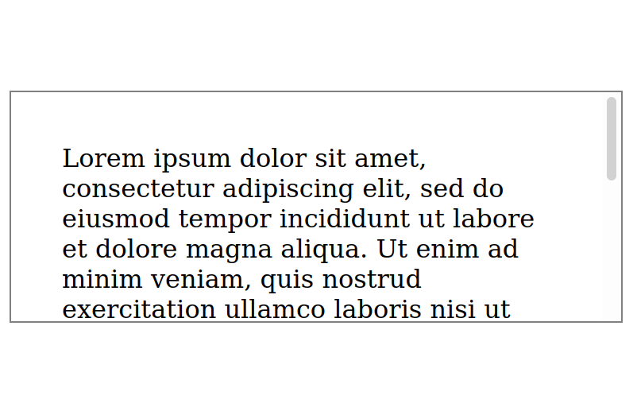
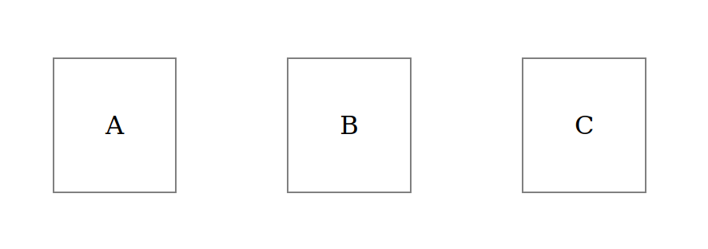
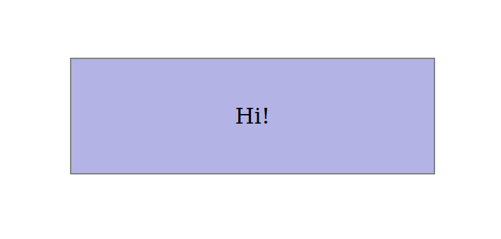

# CSS: Box Model

The box model is another core idea in CSS, and is key to mastering layout. The box model is what keeps this background color from spilling out:



The box model also helps us space these out:



The box model lets us have an area scroll, even if we want lots of space around it:



[Play with this code](https://codesandbox.io/s/zealous-frost-9trju)

## What's Going On


These are the box model properties:

* `width` / `height` - The size of the actual content area, such as the text or image.
* `padding` - The space between the content and the border. If the element has a background color, all of this will be filled in.
* `border` - An optional border separating the padding from the margin
* `margin` - The space between the border and other elements in the document. If the element has a background color, this will not be filled in.

Padding and margin are known as "composite properties" because they're actually 4 properties in one.

```css
/* This... */
padding: 10px;

/* ...Is the same as this */
padding-top: 10px;
padding-right: 10px;
padding-bottom: 10px;
padding-left: 10px;
```

You can also specify the top/bottom and right/left separately:

```css
/* This... */
padding: 10px 20px;

/* ...Is the same as this */
padding-top: 10px;
padding-right: 20px;
padding-bottom: 10px;
padding-left: 20px;
```

And lastly, you can set all 4 dimensions at the same time:

```css
/* This... */
padding: 10px 20px 30px 40px;

/* ...Is the same as this */
padding-top: 10px;
padding-right: 20px;
padding-bottom: 30px;
padding-left: 40px;
```

You can remember this by thinking of a clock- the first value is "top", and it moves clockwise to "right", "bottom", then "left." This is worth memorizing, because this same sequence is used throughout CSS.

## Watch Out!

* The box model is only applied to elements with a block display mode. Inline elements do not use the box model, so none of the box model properties have any effect. If you would like to give an inline element (like a link) box model properties like padding, you can use the display mode `inline-block`.
* Values for padding and margin can have 1 value (applies to all 4 dimensions), 2 values (first is top/bottom, second is left/right), or 4 values (top/right/bottom/left). They cannot have 3 values, and you can't only put 2 values for top and right.
* You can override part of a composite property by giving a more specific property a different value. For example, the rule `padding: 10px;` can be overriden on the right side only by adding a rule for `padding-right: 20px;` after the first rule.
* By default, the `width` and `height` of a block element are independent of any padding or border. This is almost never what you want. You can override this with `box-sizing: border-box;` to make `width` and `height` include the padding and border.
