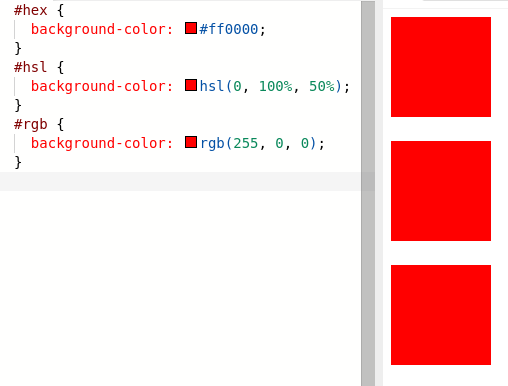

# CSS: Colors

## Why

There are a few different color formats, and you need to be conversant with all of them. You'll see them in tutorials, in design documents you're given by other developers, and in external tools you use.

## Example

All of these are the same color:



[Edit](https://replit.com/@KyleCoberly/example-same-color#index.css)

## What's Going On

There are a couple of common color formats:

### Hexadecimal

Hexadecimal, or simply "hex" for short, describes colors in terms of how much red, green, and blue is present in the color.

(image)

A hex number ranges from 0 to 15, but it represents it as a single character by using the first 6 characters of the alphabet. That means counting in Hexadecimal would go 0, 1, 2, 3, 4, 5, 6, 7, 8, 9, a, b, c, d, e, f. After f, you start over again, so counting from "16" would go 10, 11, 12, 13, 14, 15, 16, 17, 18, 19, 1a, 1b, 1c, 1d, 1e, 1f.

CSS hex colors start with a `#`, like this: `#ef020a`. This is equal to:

Amount of red = ef = 30
Amount of green = 02 = 2
Amount of blue = 0a = 10

The result will a red-heavy purple:

(image)

You can also use hex colors with 3 characters (with less precision): `#00f`. This will result in a pure blue:

(image)

This is especially common with black (#000), white (#fff), and grays (#333, etc.).

* RGB

Hex colors don't have a lot of precision. The 3-digit format only supports 16 levels for each color, and the 6-digit version still only supports 32 levels. This means that hex can only describe 32^3 ~= 33,000 colors. RGB, by contrast, supports 256 for each color value. So, 256^3 ~= 16.8 million colors. It otherwise works about the same, except it uses regular decimal numbers between 0 and 255:

```css
color: rgb(0, 0, 0); /* Black */
color: rgb(255, 255, 255); /* White */
color: rgb(0, 255, 0); /* Pure green */
color: rgb(200, 0, 100); /* Red-heavy puple */
```

* HSL

RBG is an improvement on Hex, but it's still very difficult to do "color math" in your head with, or to imagine quite what a color looks like just by looking at the numbers. HSL uses the "hue, saturation, and light" model.

* Hue: Degrees of a circle- 0 is red, as is 360. 120 is green, 240 is blue, they transition smoothly between.
* Saturation: 100% is fully saturated, 0% is grey-scale
* Lightness: 100% is white, 0% is black (regardless of the hue or saturation), 50% is moderate lightness.

```css
color: hsl(0, 100%, 50%); // Pure red
color: hsl(0, 0%, 100%); // White
color: hsl(100, 67%, 100%); // Aslo white
color: hsl(0, 0%, 0%); // Black
color: hsl(100, 67%, 0%); // Also black
color: hsl(350, 50%, 50%); // A red-heavy purple
```

HSL is great because when you need to tweak a color or build a pallette, it's much more straight-forward.

You'll see colors in all of these formats, but HSL should be your default.

## Gotchas

* The exact same color doesn't necessarily render identically in every browser
* Just because you have a color in one format doesn't mean you can't convert it to another format. All of the color formats support approximately all the same colors.

## History

Colors have been a part of CSS since the beginning, but they've gotten a lot richer over the years, and now have their own working group.
