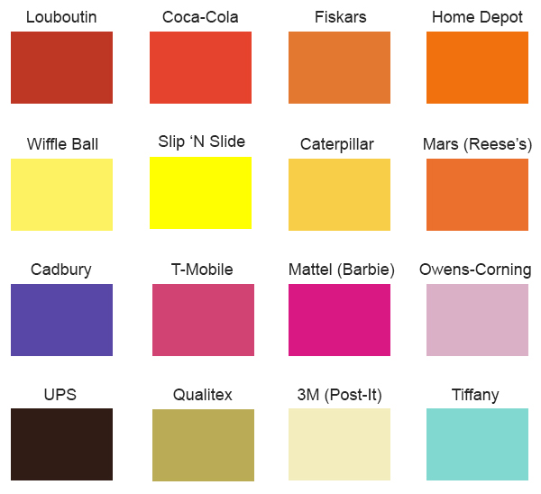

# CSS: Colors: Exercises

## Questions

* What is hue?
* What is saturation?
* What is lightness in the HSL color model?
* Describe this color: `hsl(240, 50%, 50%)`
* Describe this color: `hsl(120, 50%, 80%)`
* Describe this color: `hsl(0, 90%, 50%)`
* Describe this color: `hsl(60, 50%, 50%)`
* Describe this color: `hsl(300, 50%, 50%)`
* What color is this: `#ff0000`
* What color is this: `#00ff00`
* What color is this: `#0000ff`
* What color is this: `#f0f`
* Compare and contrast hex colors, RGB colors, and HSL colors

## Exercises

Try to generate the following colors in HSL the fewest number of guesses:

* Now convert each of them to RGB in the fewest number of guesses
* Now convert each of them to hex in the fewest number of guesses
