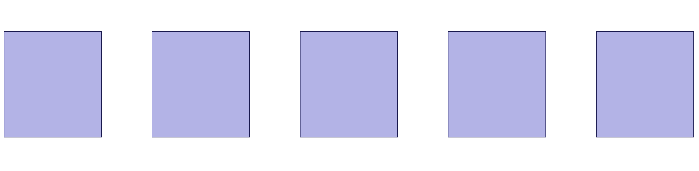
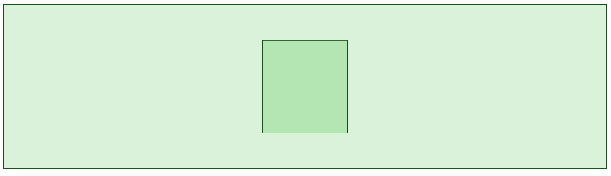
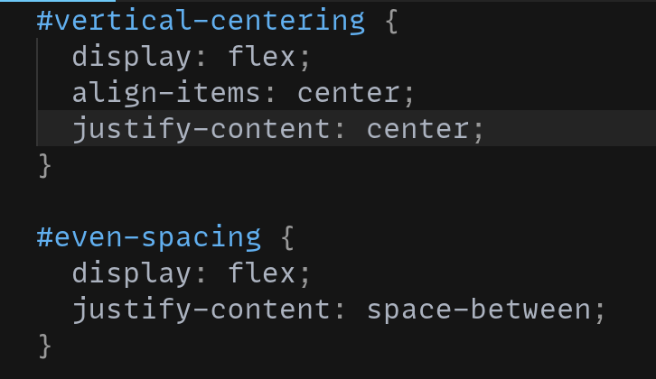

# CSS: Flexbox

There are some pretty big limits to only having `inline` and `block` display modes. How do you evenly space a group of elements out?



How do you center something vertically?



You can use CSS Flexbox:



[Play with this code](https://codesandbox.io/s/lucid-allen-gjsxb)

## Flex Containers and Flex Items

The most important concept in flexbox is the idea of a container and an item. Flex containers control how their items are rendered. For example, if you have this HTML:

```html
<ul>
  <li>One</li>
  <li>Two</li>
  <li>Three</li>
</ul>
```

You can make the `<ul>` a Flex container, and all of the `<li>`s will become Flex items.

```css
ul {
  display: flex;
}
```

You can space out the Flex items evenly:

```css
ul {
  display: flex;
  justify-content: space-between;
}
```

You can right-align them all:

```css
ul {
  display: flex;
  justify-content: flex-end;
}
```

You can vertically and horizontally center them:

```css
ul {
  display: flex;
  height: 100vh; /* Make the container take up the whole screen */
  justify-content: center; /* Horizontal center */
  align-items: center; /* Vertical centering */
}
```

There are also some properties on the Flex Items that allow them to change the order they display in, how they grow or shrink relative to each other, and whether an element's alignment should be overridden. These are less commonly used.

```css
li {
  order: 3;
  flex: 1;
  align-self: flex-end;
}
```

## Primary and Cross Axes

Another critical idea in flexbox is primary and cross axes. By default, the horizontal axis of a flex container is the primary axis and the vertical axis is the cross axis.

(example)

By changing the `flex-direction` from `row` to `column`, this is reversed:

(example)

These are the differences:

* New flex items in a flex container are added along the primary axis
* `justify-content` aligns items on the primary axis
* `align-items` aligns items on the cross axis
* Only items on the cross axis can be individually aligned:

(example)
(example)

## Watch Out

* Flexbox is well-supported in [every browser except Internet Explorer](https://caniuse.com/flexbox), which was discontinued in 2016 and has an end-of-life of August, 2021
* A flex container is still flow content. If something isn't vertically centering, make sure that the container has enough height for vertical centering to be visible.
* A flex container only controls its immediate children. The same element can be a flex item for one container, and a flex container itself.
* A flex container is treated like a block element (the container tries to take up all the horizontal space it can). You can also flex an inline element by using `display: inline-flex;`.

## Additional Resources

| Resource | Description |
| --- | --- |
| [Flex Reference](https://css-tricks.com/snippets/css/a-guide-to-flexbox/) | CSS Tricks' flex reference is the definitive guide to using Flexbox. |
