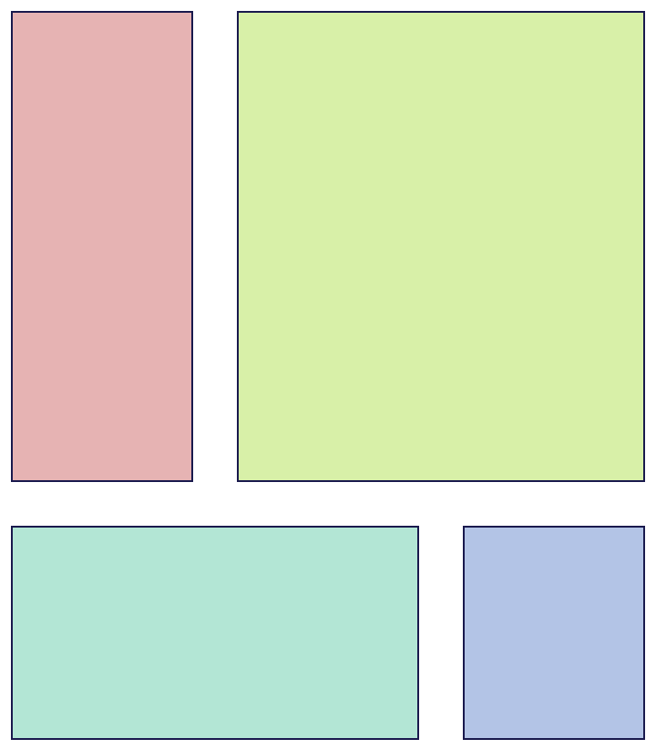

# CSS: Grid

You can do a lot with the display modes `inline`, `block`, and `flex`, but they have some limitations. What if you want to align elements to a consistent grid?



[Play with this code](https://github.com/sikaeducation/css-grid-usage)

## Grid Containers and Grid Items

Just like Flexbox, CSS Grid use the concept of containers and items. If you declare an element as a grid container:

```html
<ul>
  <li>A</li>
  <li>B</li>
  <li>C</li>
  <li>D</li>
</ul>
```

```css
ul {
  display: grid;
}
```

All of its children become grid items.

## Defining Grids

Grids have vertical and horizontal gridlines, and the space between them is a grid area. When you make a grid, you indicate where those are with `grid-template-rows` and `grid-template-columns`:

```css
ul {
  display: grid;
  grid-template-rows: 20px 40px; /* Two rows, one 20px high and another 40px high */
  grid-template-columns: 30px 50px; /* Two columns, one 30px wide and another 50px wide */
}
```

It's also common to have a combination of fixed units and relative units:

```css
ul {
  display: grid;
  grid-template-rows: 20px 1fr; /* Two rows, one 20px high and another taking up whatever is left */
  grid-template-columns: 20px 1fr; /* Two columns, one 20px wide and another taking up whatever is left */
}
```

`fr` is a CSS unit that's used in grids indicates that something should take up the remaining space. It can also be used to make rows the same size, or multiples of the same size:

```css
ul {
  display: grid;
  grid-template-rows: 1fr 1fr; /* Two rows, both the same size, taking up half the width of the container */
  grid-template-columns: 1fr 3fr; /* Two columns, the second 3 times the size of the first */
}
```

## Using Grids

To place an item on a grid, declare either its starting and ending grid line or one of those and how many grid areas it should take up.

```css
li {
  grid-row: 1 / 2 /* The row this element should be on starts at the first row gridline and ends at the second row gridline
  grid-row: 1 / span 1 /* Same thing

  grid-column: 1 / span 2 /* Take up the entire column */
  grid-column: 1 / 3 /* Same */
}
```

## Watch Out!

* `row` and `column` are easy to mix up. Columns determine how wide something is, rows determine how tall something is.
* Don't be confused by gridline counts. A 2x2 grid will have 3 horizontal gridlines and 3 vertical gridlines. The first row gridline is the top of the container, the first column gridline is the left of the container
* Only a grid's direct children can be placed on the grid. You cannot place a grid item's children on the grid.
* Don't confuse `fr` with `auto`. `fr` actively takes up as much space as it can and sets up relative sizing. `auto` lets the size of the elements inside the grid areas determine the spacing.
* Grid items don't need to start and end in any particular place on the grid and grid areas can be empty
* The way you arrange grid items has no relationship with the order in which they were declared in HTML

## Additional Resources

| Resource | Description |
| --- | --- |
| [Grid Reference](https://css-tricks.com/snippets/css/complete-guide-grid/) | CSS Tricks' grid reference is the definitive guide to using CSS grid. |
