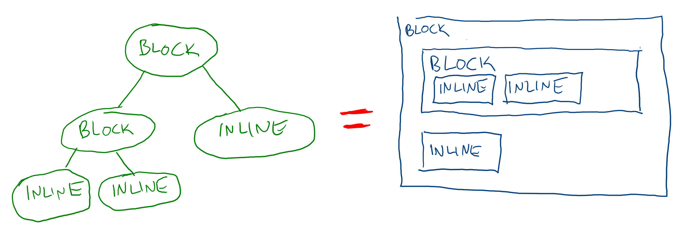

# CSS: Layout

CSS is often misunderstood, even by otherwise expert developers. High-level layout in CSS is usually where the misunderstanding starts, and getting this part right is key to understanding CSS as a whole.

Every element in HTML gets rendered as a rectangle. Sometimes the rectangle tries to take up all of the available space, sometimes it only takes up the space that it needs. These are mostly determined by the element's "display mode":

* **Block**: Elements try to take up all of the horizontal space of their parent element
* **Inline**: Elements only take up the space their needs, and allow other elements to sit on the same line if they fit

There are other display modes, but even those are largely variants on inline and block.

## Element Defaults

Some elements use the block display mode by default. These include:

* `
`
* All headings (such as `<h1>` and `<h2>`)
* All structural elements, such as `<header>`, `<footer>`, `<main>`, and `<aside>`
* `
`
* `<ul>`, `<ol>`, and `<li>`
* `<form>`

Some elements use the inline display mode by default. These include:

* ``
* All semantic text elements, such as `<strong>` and `<em>`
* `<input />` and `<label>`
* ``

Note that these are just defaults and can always be overidden with CSS.

## Watch Out!

* If the parent of an element is the entire document, it will take up the entire width of the screen
* If you set an element's height to 100%, it won't stretch its parent container out, which is counter-intuitive. To control the amount of vertical space an element takes up, the `height` of the element needs to be explicitly set.
