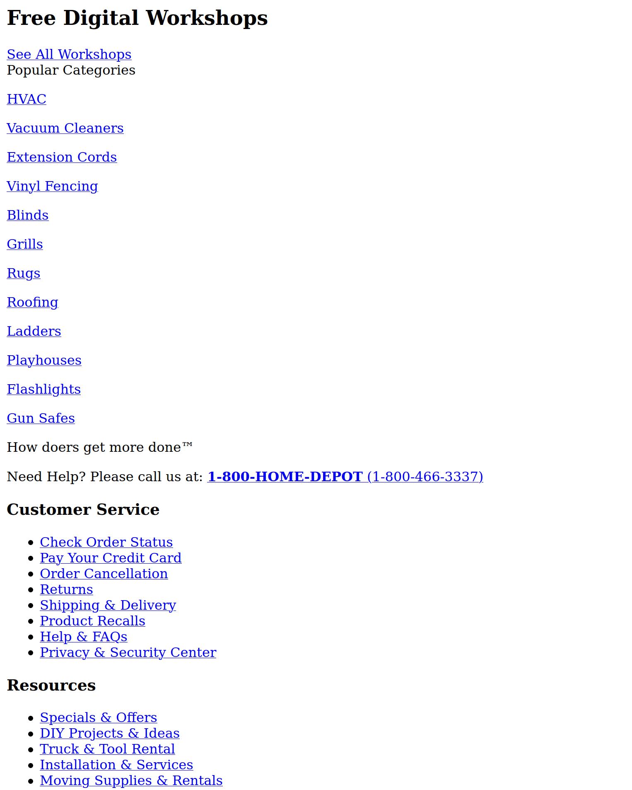
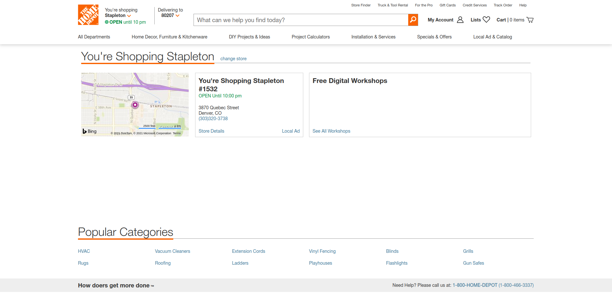

# CSS: Syntax

Unstyled pages look like undifferentiated research white papers. It's difficult to find what you're looking for, and it's difficult to tell one site from another.



If you use them correctly, stylesheets help people read and understand your content, navigate and use your apps, and relate them to the company's brand and experience.



## Adding CSS to HTML

There are 3 ways to apply CSS to a page:

### Linked

Linked stylesheets are references to CSS files that go in the `<head>` of documents.

```html
<html lang="en">
  <head>
    <title>Web Page</title>
    <meta charset="utf-8">
    <link rel="stylesheet" href="index.css">
  </head>
  <body>
    <div></div>
  </body>
</html>
```

The `href` attribute accepts any valid file path. Note that absolute paths that start with `/` will go to folder the site was served from, not the root of the computer.

### Inline

Inline styles are applied directly to an element:

```html
<div style="display: flex; justify-content: center;"></div>
```

These styles can't be overriden by custom style sheets and should be avoided.

### Embedded

An embedded stylesheet is added to the `<head>` of an HTML file directly:

```html
<html lang="en">
  <head>
    <title>Web Page</title>
    <meta charset="utf-8">
    <style>
      div {
        display: flex;
      }
    </style>
  </head>
  <body>
    <div></div>
  </body>
</html>
```

These styles clutter up HTML documents and should be avoided as well.

## CSS Syntax

CSS is made up of selectors, which target elements to apply styles, and rules, which are styles to apply to those elements. There are many kinds of selectors:

```css
form {
}
.profile > h2 {
}
#logo img::before {
}
```

Each one targets one or more elements, and then opens up a block to declare the style rules that should be applied. Within that block:

```css
form {
  display: flex;
  flex-flow: column nowrap;
  padding: 24px;
}
```

Style declarations can be added. Each one has property and a value, separated by `:` and ending with `;`. Not all declarations apply to all elements.

## Watch Out!

* Browsers apply something called a user-agent stylesheet to every web page, which is why headings are large and bold and links are blue and underlined even if you don't add your own stylesheet. Any styles you write will override these browser defaults.
* Semicolons are required at the end of style declarations in CSS.
* CSS rules are applied top to bottom. If two styles conflict, the style that happens later in the stylesheet will generally be applied. The exception to this is called specificity. In short, IDs always override classes, classes always override tags, and styles with more classes and tags in their selector will override styles with fewer classes and tags in their selector.
* Don't forget to add `rel="stylesheet"` to `<link>` tags.

## Additional Resources

| Resource | Description |
| --- | --- |
| [MDN CSS Syntax reference](https://developer.mozilla.org/en-US/docs/Web/CSS/Syntax) | MDN official reference for CSS syntax |
