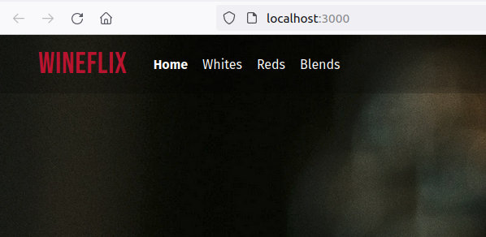
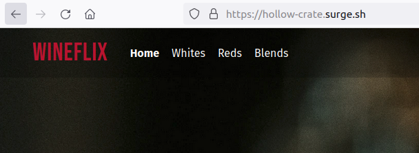
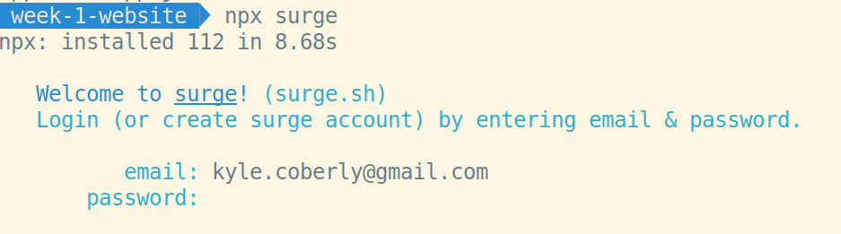
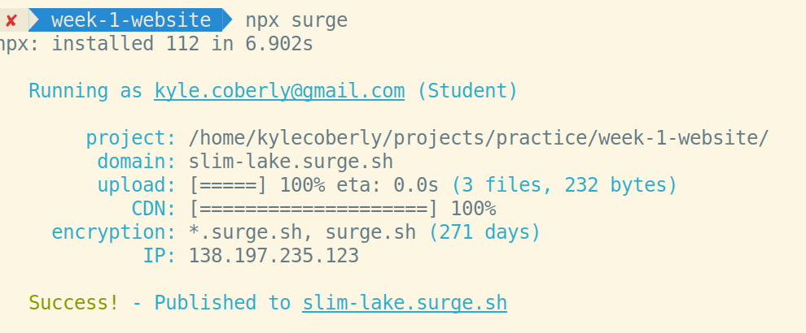

# Deployment: Surge

No matter how great your site is, it won't matter if the files are only on your computer. That means you need to be able to deploy your files to the public internet so other people can get them with their browser. This site runs on a local computer, but no one else can see it:

But once it's deployed:

It's available on the public internet and everyone can go to it.

## Deploying Sites

There are many different deployment providers, but the easiest to get started with is [Surge](https://surge.sh). To deploy to Surge, run `npx surge`. After it downloads, you'll be prompted to create an account:

Note that you won't see anything change on the screen while you're typing your password. This is normal.

Then, it will ask some questions about which folder you'd like to deploy and what you'd like the URL to be:

The folder you deploy should have an `index.html` file in it, otherwise going to the URL in a browser will 404.

To update a site you've already deployed, give it the same URL as your old deployment.
