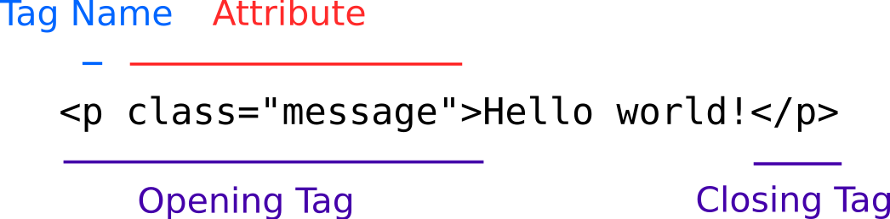
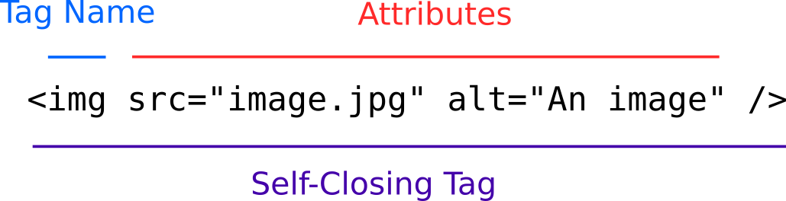

# HTML Syntax

The syntax for HTML follows some comparatively simple rules, but there's still lots of room for both style and error. HTML is a markup language, rather than a programming language. Programming languages are concerned with logic- what order things happen in, the circumstances under which they happen, and how often they should happen. Markup languages annotate or "mark up" content to indicate what content is and how it should be treated.

For example, something that looks like this in a browser:


Might be be marked up like this in HTML:

```html
<article>
  <h1>Ska’s New Generation Is Here To Pick It Up Pick It Up</h1>
  
  <p>A look at the new book In Defense Of Ska and a network of artists giving the oft-maligned genre a fresh burst of life</p>
</article>
```

## Anatomy of a tag




* **Tag name**: These indicate what a tag means
* **Attributes**: These are properties of a tag that either configure it or further describe it
* **Opening and closing tag**: Most tags have an opening and closing pair that wrap the content they describe. Any attributes go inside the opening tag.
* **Self-Closing tag**: Some tags don't have closing tags and close themselves

## Nesting

HTML tags with opening and closing tags can be nested:

```html
<ul>
  <li>Item One</li>
  <li>Item Two</li>
</ul>
```

## Anatomy of a Document

HTML files are called "documents" and have a required structure to them:

```html
<!doctype>
<html lang="en">
  <head>
    <title>Google Search</title>
    <meta charset="utf-8" />
  </head>
  <body>
    <!-- Page content all goes here -->
  </body>
</html>
```

* **`<!doctype html>`**: This declares the document is written in HTML5, rather than a previous version of HTML.
* **`<html lang="en">`**: All HTML content must go inside this. It also indicates the language of the content.
* **`<head>`**: This is for content that's not intended to show up on the page, such as linked JavaScript and CSS files and meta information about the document.
  * **`<title>`**: This is what name will show up in the browser tab.
  * **`<meta charset="utf-8" />`**: This indicates the character encoding for the document. No need to understand character encoding yet, just accept that it's a required element of the page for now.
* **`<body>`**: This is for content that is intended to show up on the page.

## HTML Style

Since HTML is whitespace-insensitive, you have flexibility over whether something goes on one line or multiple lines. Here are some recommendations:

By default, each new opening, closing, and self-closing tag should get its own line:

```html
<section>
  
  <p></p>
  
</section>
```

Opening and closing tags should be at the same level of indentation, and when a tag is nested instead of another is should move right one indentation level:

```html
<div>
  <section>
  </section>
</div>
```

When a tag has text content, it's OK to leave the opening and closing tags on the same line:

```html
<p>Paragraph content</p>
```

It's OK to leave inline text tags on the same line as the text:

```html
<p>Really <strong>important</strong> content</p>
```

If a tag has a lot of attributes, it's OK to put each attribute on its own line:

```html
<input
  id="some-id"
  class="some-class another-class"
  type="text"
  required
  min="5"
  max="100"
/>
```

HTML is case-insensitive, which means that `<article>`, `<ARTICLE>` and `<Article>` will all work. However, it is conventional to write your HTML tags all lowercase.

Indentation matters. While HTML is whitespace-insensitive (meaning that it ignores spaces and returns), inconsistent indentation makes it very difficult to read. For example, writing your code like this:

```html
<div><p>Some paragraph content here
  </section>
```

Makes it difficult to tell that neither the `<p>` tag or the `<div>` tag were closed, and that the `</section>` closing tag doesn't have a matching opening tag. Rewritten like this:

```html
<div>
  <p>Some paragraph content here
  
</section>
```

Both of these problems are easier to notice.

## Watch Out!

Self-closing tags can be written with or without the close `/`. In other words, `` and `` are both valid. This convention has an interesting history, but presently it is conventional to include the `/` on self-closing tags.

HTML attributes can be technically be enclosed in single or double-quotes. In other words, `` and `` are both valid. It conventional to use to double-quotes for all HTML attributes.

Since HTML is whitespace-insensitive, it's often technically valid to leave lots of whitespace around your markup, like this: `< img src = " image.jpg " / >`. It is conventional to keep everything "trimmed" and only use spaces to separate multiple attributes: ``.

Be careful of typographer's quotes! Most word processing programs like Word and Google Docs will substitute the `"` and `'` characters for `“`/`”` and `‘`/`’` characters (look for the curls). These are called "typographer's quotes", and cannot be used for HTML attributes. Always write your code in a text editor, not in a word processor!

There are a lot of mistakes with HTML that your browser will automatically correct for you, such as leaving off closing tags or other required elements. This doesn't mean that these things aren't problems, it just means they aren't problems for that browser, yet. Not every browser corrects the same errors the same way, there's no guarantee that the way they fix them now will be the way they fix them later, and the fixes may hide other problems later in development.

Tags need to be opened and closed in order. This is not valid:

```html
<div>
  <p>Some content
  </div>
</p>
```

## History

XML is a generic data format that stores any structured data, like this:

```xml
<person>
  <first-name>Alice</first-name>
  <last-name>Baker</last-name>
</person>
```

HTML was heavily influenced by this. At one point, there was an attempt to reconcile this and make HTML a "subset" of XML (meaning all HTML would also be valid XML). This was eventually abandoned in favor the current version of HTML, HTML5.

## Additional Resources

| Resource | Description |
| --- | --- |
| [MDN: Getting started with HTML](https://developer.mozilla.org/en-US/docs/Learn/HTML/Introduction_to_HTML/Getting_started) | MDN's tutorial introducing HTML |
