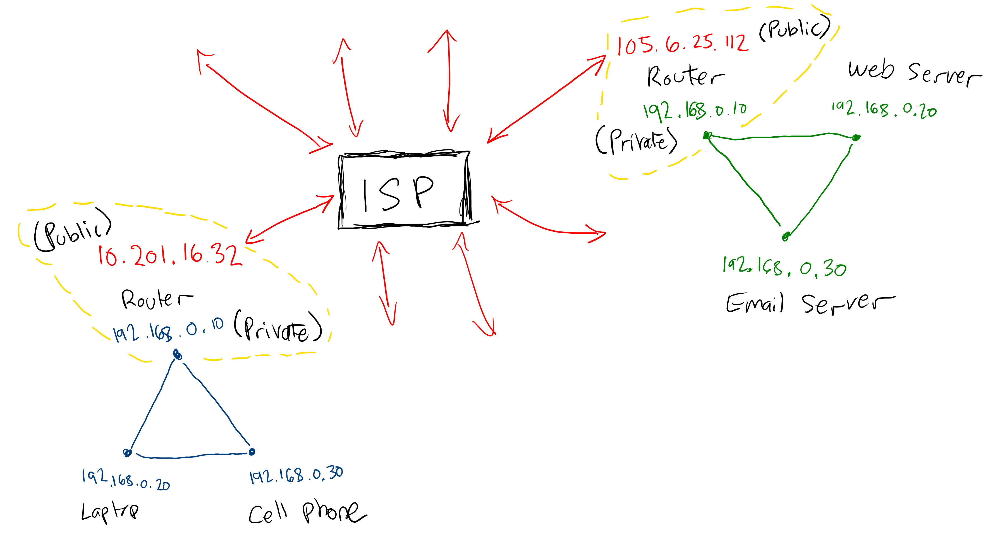

# Introduction to The Internet

While you probably use the internet every day, how much do you know about what the internet actually is and how it works?

## Networks

A network is a group of computers that can communicate with each other. They may be able to send each other files, messages, or commands; You can even log into one computer from another over a network. Each computer on a network has an address, called an IP address, that allows other computers to indentify it. This works just like a mailing address.

```bash
scp 192.168.0.105/some-file.txt .
```

This command copies a file from a computer on the network (which is called the remote computer) to the computer that's running the command (which is called the local computer).

Computers have been networked together for a long time. Originally, they were wired together in labs, then offices, then wired in homes, and then wirelessly. Any devices in your home or office that use the same internet connection are probably on the same network.

## The Internet

The internet is a network of networks. If a network is a group of computers that can communicate with each other, an internet is a group of networks that can communicate with each other. It works in much the same way an individual network does: Each network is given an IP address, and those networks can send each other files, messages, and commands.

Your IP address comes from your internet service provider, which is also called an ISP. Whenever you request a web page or do anything on the internet, your network makes a request to another network through your ISP:



Your home network is connected to the public internet via your router, which has an private IP address on your private network and a public IP address that identifies it to other computers on the network.

## Watch Out!

* Your computer has an IP address on your network, and your network has an IP address on the internet. The two address are not related.
* Your computer can send a message to a network on the internet, but you can't send it to a specific computer on that network. It's that network's job to figure out which of its computers should handle a particular request.

## History

The internet was originally a US military project called ARPANET. It was later opened up to universities and researchers to help people share research, and around 1989 it was opened for commercial use. That coincided with Tim Berners-Lee's creation of the web around the same time, which began the internet as we know it today.

## Additional Resources

| Resource | Description |
| --- | --- |
| [MDN: How the Internet Works](https://developer.mozilla.org/en-US/docs/Learn/Common_questions/How_does_the_Internet_work) | MDN's article on how the internet works |
| [Wikipedia: Internet](https://en.wikipedia.org/wiki/Internet) | Wikipedia article on how the internet works |
| [Video: What is the Internet?](https://www.youtube.com/watch?v=Dxcc6ycZ73M) | Code.org's guide to the internet |
| [Video: IP addresses and DNS](https://www.youtube.com/watch?v=5o8CwafCxnU) | Code.org's guide to the IP addresses and DNS |
| [Video: Wires, Cables, and Wifi](https://www.youtube.com/watch?v=ZhEf7e4kopM) | Code.org's guide to the physical infrastructure of the internet |
