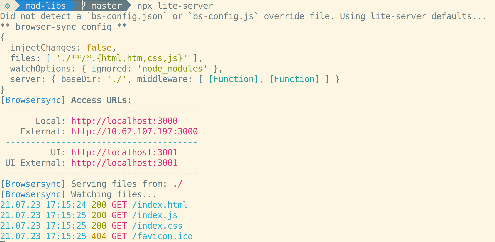
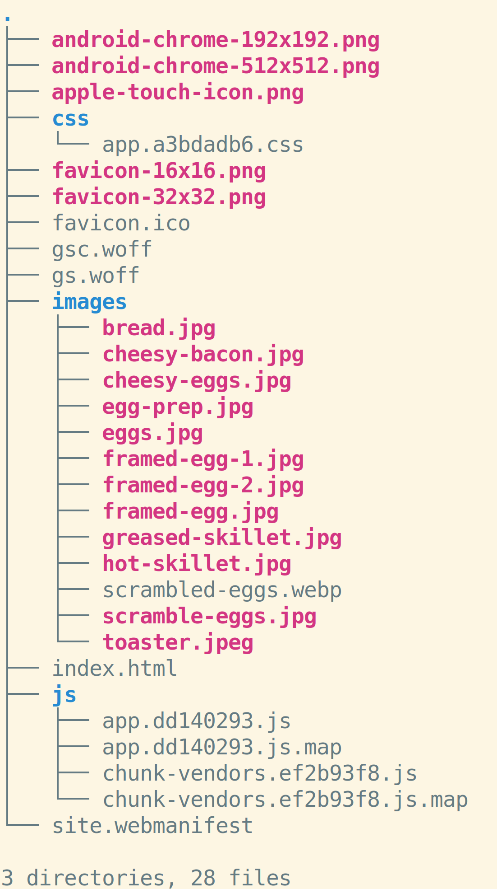
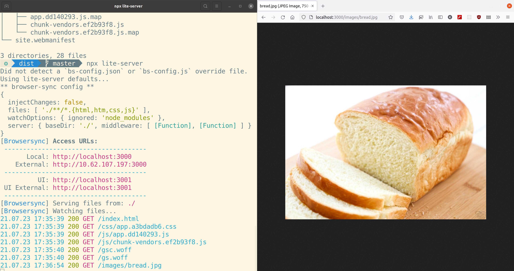

# Local File Servers

When you view a website in a browser:

1. You enter a URL into your browser
2. Your browser looks up the IP address for that URL
3. Your browser asks for the HTML file from the file server at that IP address
4. The file server at that IP address returns the contents of that file
5. Your browser renders a page based on the contents of that file

What if we just want to see a website that's stored on our computer? We can use a local file server.

## Running `lite-server`

`lite-server` is a program that runs a file server on your computer. To serve a website with `lite-server` on your computer, navigate to the folder containing the website in your terminal (it's the one with your `index.html` file) and run the command `lite-server`. It will likely open a browser tab at the correct URL automatically. If it doesn't, take a note of the local URL printed on the screen:

Going to this URL in your browser will render the site.

This will take a little bit longer to run the first time, but should be faster after that. There are many alternatives to `lite-server`, including Python's `simpleHTTPServer`, Node's `http-server`, and WAMP/MAMP/XAMPP. The major advantage of `lite-server` is that it will automatically refresh show changes to websites as you work on them.

The paths in this URL will mirror the directory structure:

Note that all HTTP requests to the file server will be logged to the terminal. This can be helpful for debugging.

You can stop `lite-server` with `ctrl` + `c`.

## `localhost`

What is the URL for a server that's running on your computer? Generally, we use the URL `localhost`. Notice that it doesn't have a TLD or subdomain, so it's not `localhost.com` or `www.localhost`.

You may be wondering what IP address `localhost` resolves to. `localhost` is equivalent to the IP address `127.0.0.1`, which is a special IP address reserved for local computers.

## Ports

What if you want to serve multiple websites from your computer at the same time? You can run more than one file server on your computer at once, and they're differentiated by their port. `lite-server` will default to port `8080`. If that port is already being used by a program (including another `lite-server` instance), it will create the next server at `8081`, and so on.

## Watch Out!

* If you double-click on an HTML file in a folder, and your computer will probably render that page in a browser. This is not a substitute for using file server because there are problems that will result from not serving files correctly. Always use a real file server to view web pages.
* `localhost` addresses are generally served with HTTP, not HTTPS. Requests cannot be "secured" in any meaningful way within your computer. While you should only send data to a website over HTTPS normally, it's OK to use HTTP locally.
* If you get an error when running `npx lite-server` about `npx`, make sure Node has been installed.
* If you have multiple windows open for a website run by `lite-server`, you can get some unusual behavior with buttons and forms firing multiple times.
* If you get the `Cannot GET /` in the browser when starting `lite-server`, it means there was no file named `index.html` in the folder where you ran the `npx lite-server` command.
* If you suspect you have multiple instances of `lite-server` running and would like to terminate all of them, run the command `killall node`.

## Additional Resources

| Resource | Description |
| --- | --- |
| [MDN: What is a web server?](https://developer.mozilla.org/en-US/docs/Learn/Common_questions/What_is_a_web_server) | MDN's article on web servers |
| [MDN: Set Up a Local Testing Server](https://developer.mozilla.org/en-US/docs/Learn/Common_questions/set_up_a_local_testing_server) | MDN's tutorial on setting up a local server |
