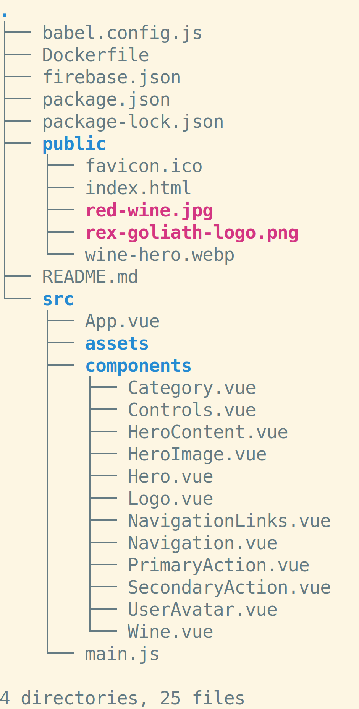

# Local File Servers: Exercises

* Why do you need to run a local server? Why can't you serve files from the file system?
* How do you stop a local server?
* In which directory should you start a local server?
* What scheme does a local file server use?
* How do kill all running instances of lite-server?
* What does this error mean: `Cannot GET /`
* What is the IP address for `localhost`?

## Activities

Clone the [Mad Libs repository](https://github.com/sikaeducation/mad-libs).

Serve the app with a local file server.

---

Given this folder structure:

What would the URL to `red-wine.jpg` look like if the root of the folder were served up on port 8080 on localhost?
