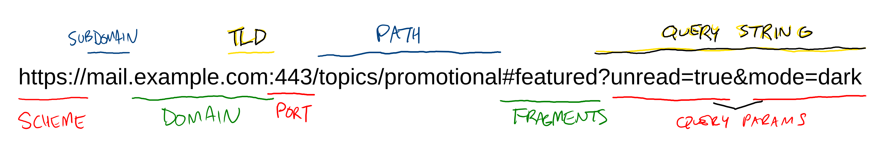

# URLs

You likely use URLs daily, but do you know what the different parts of the URL mean? URL stands for "Uniform Resource Locator." This means that it's a standardized way to locate resources on the internet- no two HTML pages, images, stylesheets, etc. need to have the same address.

## Anatomy of a URL

* **Scheme**: This indicates the "protocol" that the browser will use on the URL. The most common protocols on the web are `http://`, and its more secure variant `https://`.
* **Subdomain**: This allows a website to be split into multiple logical components. Browsers treat each one as a completely separate website, with no history or settings shared between them.
* **Domain**: A nickname for an IP address.
* **Top-Level Domain (TLD)**: This indicates who a URL is registered with, and may indicate how something about its purpose.
  * `.com` - Licensed by [Verisign](https://www.verisign.com/), originally intended for for-profit commercial activity. Today, it's mostly a generic TLD.
  * `.org` - Licensed by [Affilias](https://afilias.info/), originally intended for not-for-profit organizations. Today, there are no restrictions on who may use a `.org` address.
  * `.edu` - Licensed by [Educause](https://www.educause.edu/), this is only licensed to degree-granting accredited institutions.
  * `.gov` - Licensed by the [US General Services Administration](https://www.gsa.gov/), this is only licensed to government entitites.
  * There are hundreds more, and more being added regularly.
* **Port**: This is usually not explicitly used on the consumer web. If left off, it defaults to `80` for HTTP and `443` for HTTPS. It is more common to specify a port when accessing sites on a local network.
* **Path**: Everything after the domain but before the query string. It's common for this to mirror the directory structure of the folder serving the website by default, but this behavior can be customized. If no file name is specified in the path, most servers default to looking for a file called `index.html`.
* **Fragment**: A fragment will scroll the page to the first element that has the fragment as its `id` attribute.
* **Query String**: A set of key/value pairs that are sent to the server. This can be used to send data, filter the results, or otherwise send options along with the request. These aren't encrypted, and can be bookmarked or shared with others.

## Watch Out!

* While it was once common to prefix URLs with `www`, this is just a regular subdomain and does not otherwise confer any special meaning.
