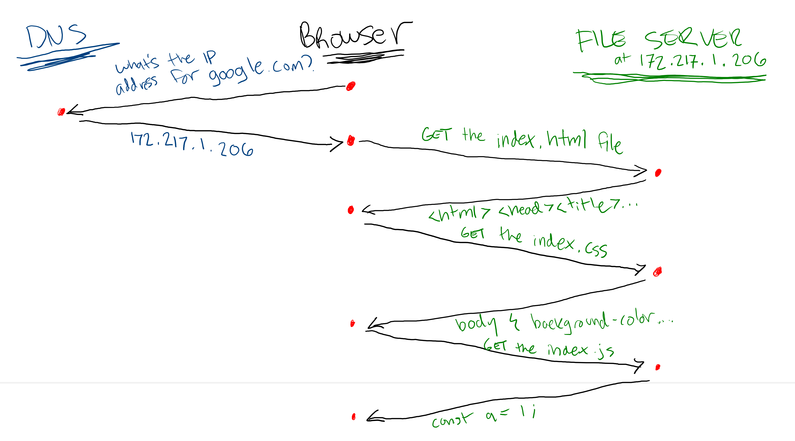

# Introduction to the Web

In common language, we use the terms "internet" and "web" interchangeably, but they're actually different things. The internet is a network of networks; the web is a set of technologies that runs on top of it.

## Web Technologies

These are some common technologies that make up the web:

### Domains

Look at these IP address:

```
172.217.1.206
31.13.93.35
104.244.42.129
```

Could you remember them? Maybe you'll recognize them better by their nicknames:

```
172.217.1.206 => google.com
31.13.93.35 => facebook.com
104.244.42.129 => twitter.com
```

A domain is an easier-to-remember shortcut to a IP address. When you use a domain to look up a network, your computer looks up the matching IP address for that domain.

### Browsers

A browser is a program that can request and display files from the internet. It provides a non-technical way to generate HTTP requests, render HTML and CSS files to the screen, display multimedia content, and run programs written in JavaScript. Additionally, browsers often provide tools for making it easier to use the web such as bookmarking URLs and keeping track of sites you've been to.

### HTTP

Networked computers can share all kinds of things with each other. One way they can do that is with HTTP, which is a format for sending and receiving messages over the internet.

### HTML, CSS, and JavaScript

HTML and CSS are instructions on how to display content that your browser understands. JavaScript is a programming language your browser understands that makes that content interactive. This are usually stored in files that your browser can request with HTTP.

## Putting it all together

When you type a URL into a browser and hit enter:



1. The browser looks up the IP address for that URL
2. It sends an HTTP request to that IP address asking for an HTML file, and then starts rendering it to the screen
3. If the HTML file contains instructions to include CSS, JavaScript, images, or other files, it does so following the same process until the entire HTML file has been processed
