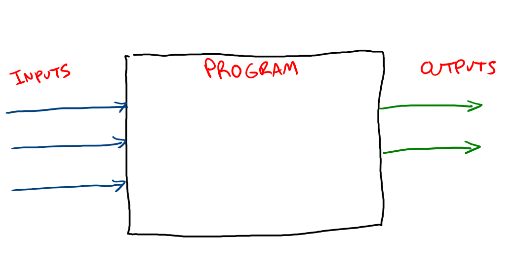
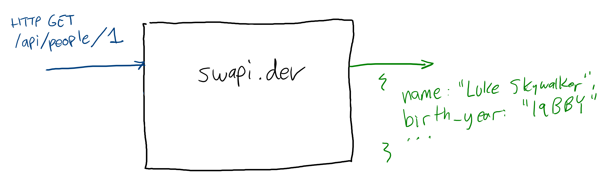

# Intro to APIs

When you're building an app that needs data or processing, you have two options:

1. Store the data in a database or write the functionality yourself
2. Get data or processing from someone else

When you get data or processing from someone else on the web, you're "getting it from from an API." API stands for Application Programming Interface, and is a broad term for what kinds of inputs a piece of software accepts and what kinds of outputs it generates as a result.

All software has this general shape:



When software is used by humans, they interact with the software through an interface that may include forms, buttons, text input, and other controls. If a piece of software is supposed to be used by other software, interfaces are more complicated because there needs to be agreement ahead of time about which inputs generate which outputs. A computer can't intuit its way through an interface designed for humans, so the interfaces need to be more explicit.

[Diagram of implementation and API for a sum](assets/sum.png)

This is a function called `sum` that accepts an array of numbers and returns their sum as a number. This could be implemented many ways:

```js
function sum(...numbers){
  let sum = 0

  for (number of number){
    sum += number
  }

  return sum
}
```

```js
function sum(...numbers){
  return numbers.reduce((numbers, number) => sum += number, 0)
}
```

```js
function sum(...numbers){
  let sum = new Number()

  while (numbers.length){
    let number = new Number(numbers.pop())
    sum.add(number)
  }

  return sum
}
```

Each of those functions has a different implementation, but has the same API.

This concept applies to all software, not just functions. For example, the `ls` command on the CLI takes a path to a folder as an input and generates a list of all the contents of that folder as an output. It even applies to software delivered over HTTP. If you make an HTTP GET request to `https://swapi.dev/people/1`, you'll get an HTTP response containing a bunch of details about that character:



These HTTP APIs are properly called web services, but they're also referred to generically as APIs.

In an app that allows people to organize their favorite Pokémon, you could add every single Pokémon to a database you own, including names, pictures, abilities, and so on. Not only would this be time-consuming, but that also means that every time a new game comes out, we would need to update the database ourselves. Luckily, there's a public [Pokemon API](https://pokeapi.co) that maintains this data already and allows developers to use their data in their applications.

APIs can do more than just return saved data. APIs can create and manipulate stored data and do calculations and transformations such as turning text into audio files or identifying the subject matter of images. Instead of writing all of that functionality yourself, you can integrate these functions into your apps as if you wrote them yourself.

Here are some examples of public APIs:

* __[Yahoo! Finance](https://rapidapi.com/blog/how-to-use-the-yahoo-finance-api/)__: View real-time stock prices
* __[API Football](https://www.api-football.com/)__: Check out NFL stats
* __[Firebase Dynamic Links](https://firebase.google.com/docs/dynamic-links/create-links)__: Give it a long URL, get back a short URL
* __[Skyscanner Flight Search](https://skyscanner.github.io/slate/#api-documentation)__: Search flight data and ticket price quotes
* __[IBM Watson](https://www.ibm.com/watson)__: Use IBM's supercomputer Watson to do a variety of artificial intelligence tasks

## Additional Resources

| Resource | Description |
| --- | --- |
| [Wikipedia: API](https://en.wikipedia.org/wiki/API) | Wikipedia's article on APIs. |
| [FreeCodeCamp: What is an API? In English, please.](https://www.freecodecamp.org/news/what-is-an-api-in-english-please-b880a3214a82/) | FreeCodeCamp article on APIs and web services for beginners. |
| [Video: APIs for Beginners](https://www.youtube.com/watch?v=GZvSYJDk-us) | FreeCodeCamp's intro to APIs |
