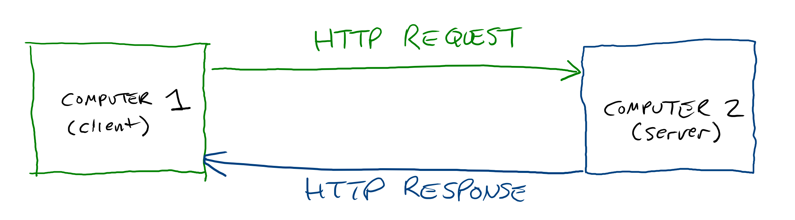

## Intro to HTTP

When you request files on the internet or request data from an API, what is the browser actually sending? HyperText Transfer Protocol, or HTTP, is a format for sending and receiving messages over the internet. One computer, called the client, sends a message to another computer on the network called the server. Every request is expected to have a matching response to be considered complete. HTTP is language-agnostic, meaning that JavaScript can send an HTTP request that is received by a Ruby server, which can then generate a request that is sent to a Java server, and so on. HTTP can be thought of as a neutral format that most programming languages can read and write.



## HTTP Requests

An HTTP request looks like this:

```
GET / HTTP/1.1
Host: localhost:8080
User-Agent: Mozilla/5.0 (X11; Ubuntu; Linux x86_64; rv:88.0) Gecko/20100101 Firefox/88.0
Accept: text/html,application/xhtml+xml,application/xml;q=0.9,image/webp,*/*;q=0.8
Accept-Language: en-US,en;q=0.5
Accept-Encoding: gzip, deflate, br
Connection: keep-alive
Upgrade-Insecure-Requests: 1
Pragma: no-cache
Cache-Control: no-cache
TE: Trailers
```

It's not important to understand every line of HTTP requests, but there are a couple of areas worth highlighting:

### Methods

`GET` is the "method" of this HTTP request. Methods are verbs that describe what you would like to do to the resource at the URL:

* `GET` - Read
* `POST` - Create
* `PUT` or `PATCH` - Update
* `DELETE` - Delete

When you're requesting HTML, CSS, and JavaScript files, your HTTP requests are all using the `GET` method. When working with APIs, sometimes you're also creating, updating, or deleting data, hence the need for other methods.

### URLs and Paths

The example HTTP Request is requesting the document at the root (`/`) of the domain `localhost:8080`. It could also be requesting the data at `/api/v2/pokemon/pikachu` from the domain `pokeapi.co`. Part of the HTTP process is looking up the IP address for the domain.

### Headers

The rest of the HTTP request is key/value pairs, which are called headers. Headers can do things like:

* Tell the server what kind of browser you're using, including whether you're on a mobile device
* Send secret keys that authorize you to get protected data
* Tell the server what kind of capabilities your browser has so the server can send the response in a format your browser understands
* What language you would prefer if multiple options are available
* Some custom data specific to your application

If the server is written in JavaScript, the headers might be parsed into a JavaScript object when received:

```js
{
  "Host": "localhost:8080",
  "User-Agent": "Mozilla/5.0 (X11; Ubuntu; Linux x86_64; rv:88.0) Gecko/20100101 Firefox/88.0",
  "Accept": "text/html,application/xhtml+xml,application/xml;q=0.9,image/webp,*/*;q=0.8",
  "Accept-Language": "en-US,en;q=0.5",
  "Accept-Encoding": "gzip, deflate, br",
  "Connection": "keep-alive",
  "Upgrade-Insecure-Requests": "1",
  "Pragma": "no-cache",
  "Cache-Control": "no-cache",
  "TE": "Trailers",
}
```

The server can use this data to help generate its response. For example, the request might specify a particular language or format to be used, including authorization credentials, or specify what kinds of compression or encoding the browser understands.

### Body

If the HTTP request is adding data (such as creating a new user), it may also include that data in the HTTP request:

```
POST /users HTTP/1.1
Host: localhost:8080
User-Agent: Mozilla/5.0 (X11; Ubuntu; Linux x86_64; rv:88.0) Gecko/20100101 Firefox/88.0
Accept: application/json,application/xhtml+xml,application/xml;q=0.9,image/webp,*/*;q=0.8
Accept-Language: en-US,en;q=0.5
Accept-Encoding: gzip, deflate, br
Connection: keep-alive
Upgrade-Insecure-Requests: 1
Pragma: no-cache
Cache-Control: no-cache
TE: Trailers

{"username": "usernamegoeshere", "password": "s3cr3t"}
```

In this example, `{"username": "usernamegoeshere", "password": "s3cr3t"}` is the request body.

## HTTP Responses

An HTTP response looks like this:

```
HTTP/1.1 200 OK
Content-Type: text/html; charset=utf-8
Cache-Control: max-age=3600
Content-Length: 106

<!doctype html><html><head><title>Website Name here</title></head><body><h1>Hello World!</h1></body><html>
```

Like requests, there a couple of parts worth knowing.

### Status

The status code indicates the general success or failure of the request.

### Headers

HTTP Responses have headers, and they work the same way as HTTP Request Headers. They might indicate:

* The data type the browser should treat the data in the body as
* How many characters the body has (so you can check to see if you got all of it)
* If the browser should store any data for future requests it makes (these are called cookies)
* How long the data being sent should be considered valid so the browser knows how long it can cache the data for

### Body

If the HTTP request was for a file, such as an HTML, CSS, JavaScript, or media file, the body contains the contents of that file. If the HTTP request was for data, the body contains the data that was requested, often formatted as JSON or XML.

## Watch Out!

* Just because it's called an "HTTP Request" doesn't mean that you always receive data in the response. For example, a `DELETE` request generally doesn't have a body in its HTTP response. "Request" in this sense just means that you're asking the server to do something, not necessarily send you data.
* `GET` requests generally don't have HTTP request bodies but do get HTTP response bodies. `POST`, `PUT`, and `PATCH` requests generally have both request and response bodies. `DELETE` requests generally have neither.
* HTTP requests and responses are untyped. That means there's no concept of objects, arrays, booleans, or strings- it's just a bunch of characters that are arranged in a particular pattern. It's up to the clients and servers to interpret the data in them as appropriate.
* HTTP requests were originally sent in plain text, meaning other computers like the router or the ISP could see all the data inside of them. The more secure variant of HTTP called HTTPS encrypts the body and headers of the request so that only the client and server know what's in them. These protocols are otherwise identical, and are both commonly referred to as HTTP.

## Additional Resources

| Resource | Description |
| --- | --- |
| [MDN: HTTP](https://developer.mozilla.org/en-US/docs/Web/HTTP) | MDN's collection of tutorials and references on HTTP. |
| [Video: HTTP Crash Course and Exploration](https://www.youtube.com/watch?v=iYM2zFP3Zn0) | Traversy Media's guide to HTTP |
