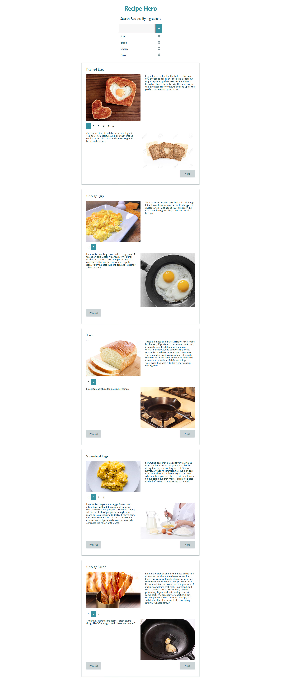

# Recipe Hero

Refactor the HTML and CSS in `src/App.js` to use components and dynamically filter data.

* Your solution should have over 7 components
* Replace all hard-coded data with dynamically fetched data from the `recipes.json` file in the `public` folder
* The ingredients should be generated dynamically
* As ingredients are added from the list, the list of available recipes should filter in real time
* Recipe step navigation should be functional
* There should be a default message displayed if no recipes match the selected ingredients

## Rubric

* [ ] - Code has over 7 components
* [ ] - No hard-coded data, including ingredients
* [ ] - Recipes are fetched from JSON file
* [ ] - Adding and removing ingredients changes the available recipes
* [ ] - Multi-step Recipes can navigate forward and backward
* [ ] - Having no recipe matches displays a useful message
* [ ] - Styling is preserved
